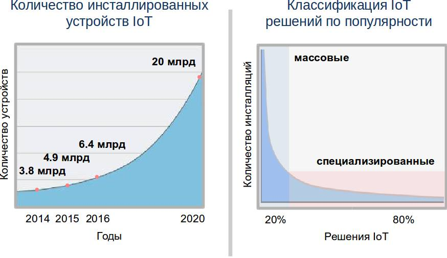
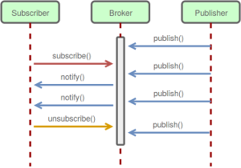
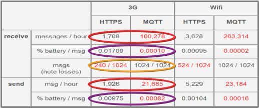
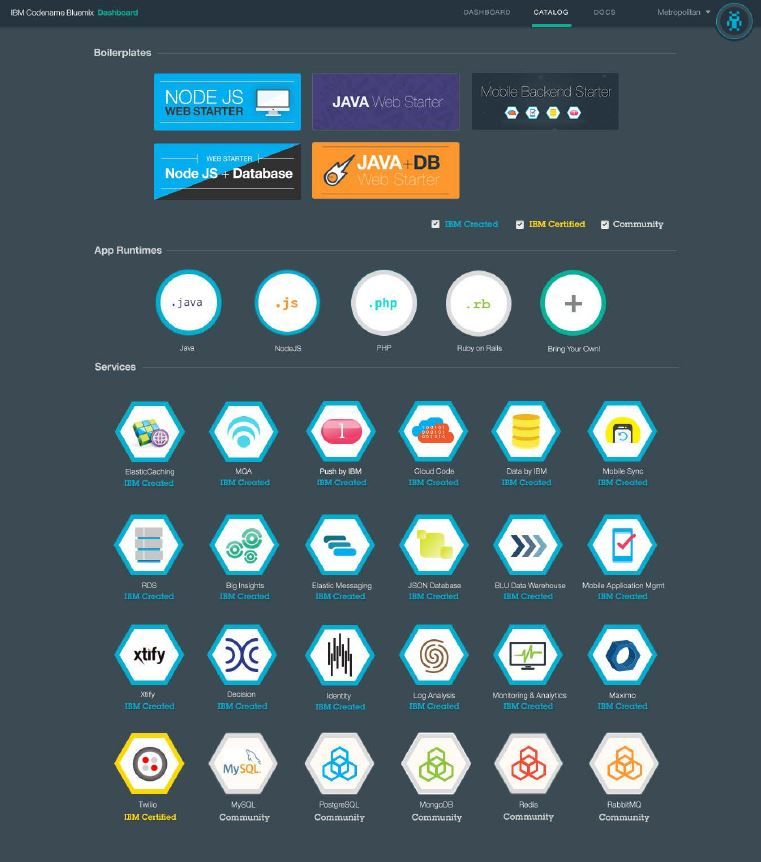
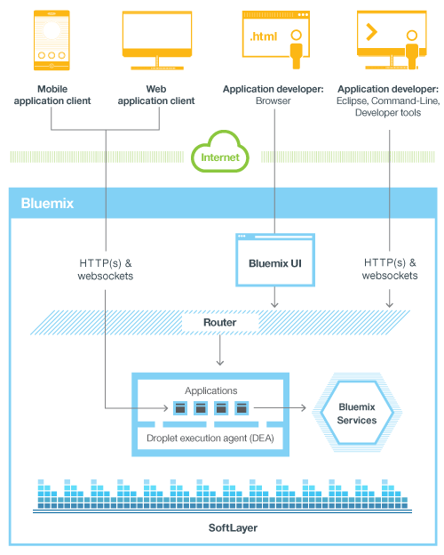
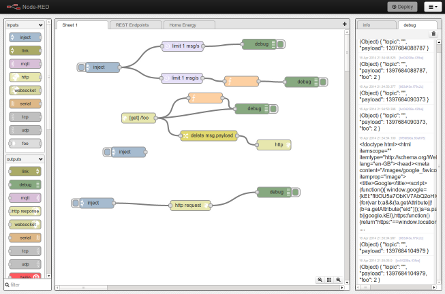
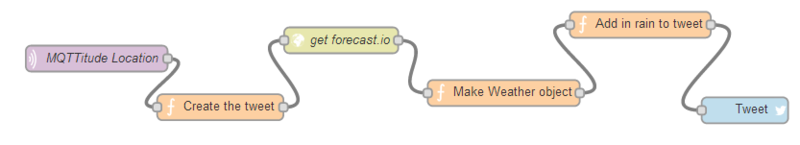

##Введение 

Воплощение потенциала идей, заложенных в концепцию Интернета вещей, способно существенно изменить уклад современной экономики. Благодаря внедрению масштабируемых облачных решений, использованию большого количества датчиков и распределенных микропроцессорных систем уже в ближайшее время могут быть созданы прорывные решения в таких областях, как: транспорт, сельское хозяйство, промышленное производство, здравоохранение, социальная сфера, быт и других. Все большее количество компаний обращает внимание на применение идей и технологий Интернета вещей для внедрения аналитики их деятельности и поиска новых возможностей для продуктов и услуг.

> *Интернет вещей (англ. Internet of Things, IoT) — это концепция вычислительной сети физических объектов («вещей»), оснащённых встроенными технологиями для взаимодействия друг с другом или с внешней средой.*
> 

Перечислим некоторые интересные факты:
-   По оценкам специалистов, к 2020 году к сети Интернет будет подключено до 50 млрд устройств, 20 млрд из них будут задействованы в инфраструктуре IoT.

-   До 90% данных, анализируемых устройствами Интернета вещей ранее не подвергались обработке.
-   До 60% данных, получаемых устройствами Интернета вещей, остаются актуальными лишь несколько миллисекунд.
-   В настоящее время только 0,1% устройств, способных выполнять полезную вычислительную нагрузку, подключены к сети.

****
### Инфраструктура типового решения IoT 

Под типовым решением Интернета вещей в данном конкурсе понимается распределенная кибер-физическая система, интегрирующая вычислительные ресурсы в физические процессы. В такой системе должны быть реализованы следующие основные функции:

-   Сбор первичных данных с помощью сенсоров, расположенных в непосредственной близости от реальных объектов.
-   Управление объектами через актуаторы, подключенные к микрокомпьютерам.
-   Передача первичных данных от микрокомпьютеров в вычислительный хаб и  в обратном направлении.
-   Первичная обработка данных в вычислительном хабе, формирование     пакетов данных для передачи их в облако.
-   Получение и хранение данных в облаке.
-   Аналитическая обработка в облаке и формирование ключевых показателей эффективности (KPI) на основе данных об объектах, данных от сторонних источников, исторических данных.
-   Визуализация данных и результатов анализа на различных платформах: мобильных устройствах, носимой электронике, планшетах, компьютерах,     мониторах и пр.
-   Прием команд от внешних управляющих консолей.
-   Принятие решений на основе KPI и команд, выработка управляющих и информационных сообщений для актуаторов.
-   Передача управляющих сообщений в вычислительные хабы.

Примером подобной системы является структура, представленная на следующем рисунке.

**Пример решения Интернета вещей**

В примере использовано оборудование:

-   Светодиоды в качестве имитации актуаторов.
-   Датчики для регистрации необходимых параметров объекта (например,
    датчики температуры и влажности).
-   Микрокомпьютеры Arduino Uno для управления актуаторами и получения
    данных от датчиков.
-   Беспроводные радиочастотные модули RF 433 МГц для коммутации
    микрокомпьютеров с вычислительным хабом.
-   Плата расширения Gove для подключения датчиков, актуаторов и RF
    модулей к микрокомпьютеру.
-   Микрокомпьютер RaspberryPi 2 в качестве вычислительного хаба.
-   Облачная платформа IBM Bluemix для реализации сервисов хранения,
    аналитической обработки и визуализации данных.

Система работает следующим образом. Информация от датчиков через соединительные разъемы на платах Grove передается в микрокомпьютер Arduino. Прием информации осуществляется под управлением программы на языке C с заданной разработчиком периодичностью. Собранные данные собираются в пакеты и снабжаются идентификаторами номера датчика.

**Функциональная схема проекта**

Через радиомодуль `RF433` данные от многих микрокомпьютеров передаются в вычислительный хаб (`RaspberryPi`). Хаб формирует пакеты `MQTT` и передает их в облако Bluemix для хранения и обработки. Обратно из облака хаб получает команды управления актуаторами, в качестве которых используются светодиоды. Таким образом, по команде выполняется включение и выключение светодиодов.

Данные из MQTT пакета поступают в брокер в составе сервиса IoT Foundation. Настроечные параметры подключенных устройств сохраняются в базе данных Cloudant.  Подписчиком данных является приложение Node-Red, которое позволяет манипулировать ими с помощью простых визуальных средств. Множество примитивных обрабатывающих блоков (нодов) представляют собой JavaScript приложения, связанные между собой потоками данных. 

Таким образом JavaScript приложения в Node-Red выполняют сохранение полученных данных в базе dashDB. Другое приложение JavaScript запускает скрипт на языке R, который выполняет регрессионный анализ данных от датчиков и определяет предиктивное значение для некоторого предстоящего момента времени. 

Полученные результаты предиктивного анализа также сохраняются в базе dashDB. По полученным первичным данным и предиктивным данным строятся графики, которые визуализируются на html странице, доступной для просмотра в броузере.

На странице воспроизводится кнопка оператора, при нажатии на которую формируется MQTT пакет, который через брокер поступает в хаб RaspberryPi и приводит к переключению состояния первого светодиода. В случае превышения предиктивных показаний установленного предела автоматически формируется другой MQTT пакет, который приводит к переключению второго светодиода. 

****

### Протокол MQTT 

MQTT (*Message Queue Telemetry Transport*) - упрощенный протокол сетевого уровня для обмена сообщениями между устройствами. Этот протокол работает поверх стека TCP/IP и разработан для преодоления проблем, связанных с подключением быстро растущего числа датчиков, микрокомпьютеров, приводов, телефонов, планшетов. В настоящее время MQTT является наиболее распространенным протоколом для организации IoT инфраструктуры.

MQTT организован по принципу издатель/подписчик(*publisher/subscriber*): издатель (устройства типа *publishers*) является отправителем сообщения, которое публикуется в централизованном сервисе (брокере сообщений), а подписчик (устройства типа *subscriber*) получает сообщение из брокера. Для использования брокера MQTT необходимо пройти процедуру подписки на определенные темы публикуемых сообщений.

**Диаграмма последовательностей для одного подписчика**

В процессе работы издатель передает данные с указанной темой сообщения, которое сопоставляется брокером с темами подписчиков. В случае совпадения, каждый из них получает экземпляр данных.

Наиболее распространенной реализацией протокола MQTT является библиотека Paho MQTT (http://www.eclipse.org/paho). Библиотека реализована для наиболее популярных языков программирования: C/C++, Java, Javascript, Python, Lua, Go, C\#.

**Сравнение протоколов MQTT и HTTPS**

Небольшие накладные расходы, связанные с хорошо продуманным форматом заголовков, позволяют эффективно применять этот протокол для решений Интернета вещей. В таблице показаны результаты экспериментального сравнения протоколов MQTT и HTTPS. Эксперименты [показывают](http://stephendnicholas.com/posts/power-profiling-mqtt-vs-https), что данный протокол обладает небольшими накладными расходами на стороне устроства, что позволяет сократить расход энергии аккумуляторной батареи и увеличивает количество передаваемых в единицу времени сообщений. В связи с этим протокол MQTT будет использован в данном проекте для транспортировки пакетов данных и команд между распределенными устройствами Интернета вещей и аналитическими средствами облачной платформы IBM Bliemix. 

****

### Облачная платформа *Bluemix* 

***Bluemix*** — это открытое облачное предложение типа PaaS
(*Platform-as-a-Service*) на базе проекта с открытым исходным кодом Cloud Foundry. Эта платформа предназначена для разработки и хостинга приложений, а также упрощения задач по управлению инфраструктурой. Она позволяет быстро создавать и развертывать приложения, а также управлять ими.

***Bluemix*** обеспечивает следующие возможности:

-   быстрое и инкрементное составление приложений из сервисов;
-   непрерывное внесение изменений в приложения и обеспечение постоянной     доступности;
-   поддержка высокоспециализированных моделей программирования и сервисов для конкретных рабочих нагрузок;
-   встраивание высокой степени управляемости в сервисы и приложения;
-   оптимизация и эластичная адаптация к рабочей нагрузке.

**Каталог компонентов Bluemix**

Платформа *BlueMix* достигает этих целей посредством абстрагирования и скрытия большинства сложностей, традиционно сопутствующих хостингу приложений в облаке и управлению ими в облачной среде. *Bluemix* может быть использована разработчиками для создания и применения самых разных приложений, включая веб-приложения, мобильные приложения, приложения для работы с большими данными, приложения для разумных устройств и т.д. *Bluemix* поддерживает разработку на популярных языках программирования и средах разработки. Java-технологии, средства создания серверных частей для мобильных приложений, мониторинг приложений, технологии с открытым исходным кодом и т. д. — все эти возможности
доступны в облаке как сервисы.

Каталог *Bluemix* содержит большую часть из того, что необходимо для быстрого начала работы, большое количество шаблонов, заранее сконфигурированны наборов сервисов, сред исполнения и примеров кода, готовых к использованию:

-   сред исполнения, в том числе: Liberty for Java, Node.js, Ruby on Rails;
-   веб-сервисов и сервисов приложений, в том числе: Data/Session Cache,  ElasticMQ, Decision, SSO, Log Analysis, Redis, RabbitMQ, Twilio;
-   мобильных сервисов, в том числе: push-уведомлений, Cloud Code,     Mobile Application Management, Mobile Quality Assurance;
-   сервисов управления данными, в том числе: MongoDB, реляционной базы данных от IBM, JSON-базы данных от IBM, MySQL, PostgreSQL, MobileData, Mobile Sync, BLU Data Warehouse, MapReduce;
-   сервисов мониторинга и анализа;
-   сервисов DevOps Services (прежнее название: JazzHub).

****

### Краткое описание концепций *Bluemix* 

В терминологии *Bluemix* приложение (*application*) — это созданный вами артефакт, т. е. весь программный код (исходный код или исполняемые двоичные файлы), который необходимо запустить или на который необходимо сослаться в процессе исполнения. Мобильные приложения выполняются за пределами среды *Bluemix* и используют сервисы *Bluemix*, представленные приложениями. В случае веб-приложений приложение — это код, загруженный на платформу *Bluemix* с целью хостинга. Кроме того, платформа *Bluemix* способна осуществлять хостинг программного кода приложения, который вы хотите выполнять на внутреннем сервере в среде на базе контейнера.

На рисунке показаны принципы взаимодействия *Bluemix* с клинтскими приложениями.

**Принципы взаимодействия *Bluemix* с клинтскими приложениями**

***Сервис (service)*** — это код, работающий на платформе *Bluemix* и предлагающий некоторую функциональность, которую могут использовать приложения. Это может быть готовый сервис, используемый непосредственно — например, push-уведомления для мобильных приложений или эластичное кэширование для веб-приложения. Вы также можете создавать собственные сервисы в диапазоне от простых служебных функций до сложной
бизнес-логики.

***Организация (organization) и пространство (space)*** — это организационные единицы инфраструктуры, способные хранить и отслеживать ресурсы приложения. Организация содержит домены (domain), пространства и пользователей. Пространство содержит приложения и сервисы. По умолчанию используется три пространства: Development (разработка), Production (производство) и Staging (подготовка). Для приложений, которым требуется среда типа PaaS, предоставляются buildpack-пакеты, каждый из которых представляет собой набор скриптов для подготовки кода к исполнению на целевой PaaS-платформе. Buildpack-пакеты, которые включают необходимую вашим приложениям среду исполнения и могут также содержать специализированные инфраструктуры, упрощают развертывание приложения в облаке по сравнению с самостоятельной установкой и конфигурированием среды исполнения.

Использование сервисов в *Bluemix* включает три этапа:
1.  Сообщите платформе *Bluemix*, что вам требуется новый экземпляр сервиса и какое конкретное приложение будет использовать этот новый экземпляр.
2.  *Bluemix* автоматически инициализирует новый экземпляр этого сервиса и свяжет его с приложением.
3.  Приложение взаимодействует с сервисом.

***Пакеты сервисов (Service bundles)*** — это коллекции API-интерфейсов, используемых в конкретных областях. Например, пакет Mobile Services включает сервисы MobileData, Cloud Code, Push и Mobile Application Management. Доступные сервисы и среды исполнения представлены в каталоге Bluemix. Кроме того, вы можете зарегистрировать собственные сервисы.

#### Развертывание и управление приложением 

Чтобы развернуть свое приложение, необходимо загрузить его в среду *Bluemix* и указать, сколько экземпляров этого приложения должно исполняться, а затем сконфигурировать *Bluemix*, введя необходимую информацию для поддержки этого приложения.

В случае мобильного приложения среда *Bluemix* содержит артефакт, который представляет серверную часть мобильного приложения — набор сервисов, который использует приложение для взаимодействия с сервером. *Bluemix* поддерживает серверные компоненты мобильного приложения, взаимодействующие с сервисами PushWorks, Cloud Code и Mobile Data, непосредственно из пользовательского интерфейса *Bluemix*.

В случае веб-приложения необходимо предоставить в *Bluemix* соответствующую информацию о среде исполнения и среде разработки, чтобы платформа смогла сформировать надлежащую инфраструктуру для исполнения этого приложения.

При развертывании приложений и управлении ими можно использовать инструмент командной строки cf, веб-интерфейс *Bluemix* или сервисы DevOps Services.

Браузерные и мобильные клиенты — а также другие приложения, развернутые на платформе *Bluemix* и выполняющиеся за ее пределами — взаимодействуют с приложениями, работающими на платформе *Bluemix*, через API-интерфейсы типа REST/HTTP. Каждый клиентский запрос маршрутизируется к одному из экземпляров приложения или составляющих его сервисов. Среды исполнения приложений в *Bluemix* изолированы друг от друга даже тогда, когда они находятся на одной и той же физической машине.

В ходе управления приложениями можно запускать, останавливать, перезапускать экземпляры приложения (или, в случае веб-приложения, изменять их количество), а также изменять объем памяти, используемый приложением. Ключевая конструктивная особенность *Bluemix* — отличные показатели при хостинге масштабируемых приложений и артефактов приложений. На данный момент эта платформа не масштабирует приложение автоматически в соответствии с нагрузкой, поэтому этим процессом необходимо управлять самостоятельно посредством создания или удаления экземпляров при изменении рабочей нагрузки. По этой причине ваши приложения должны сохранять все персистентные данные за пределами приложения в одном из сервисов хранения данных, предоставляемых платформой *Bluemix*. При повторном развертывании приложения после обновления используется тот же процесс, что и при начальном развертывании. *Bluemix* останавливает все исполняющиеся экземпляры и переводит новые экземпляры в рабочее состояние автоматически.

#### Сервисы DevOps Services для *Bluemix* 

При использовании DevOps Services требуется лишь несколько простых шагов для организации взаимодействия с другими специалистами с целью планирования, отслеживания и создания программного обеспечения в облаке. Вы можете воспользоваться встроенным в браузер редактором программного кода, который DevOps Services предоставляет для разработки приложений, или использовать DevOps Services с Eclipse, с VisualStudio или с инструментом командной строки Git для написания кода приложения и развертывания его на платформе BlueMix.

При работе с пользовательским интерфейсом, который помогает разработчику быстро добавлять сведения "кто", "что" и "когда" для своего рабочего проекта, требуется потратить всего несколько минут на задание дат, документирование первого сценария применения, назначение одной-двух задач и переход непосредственно к написанию программного кода.

DevOps Services включает встроенные средства управления исходным кодом — Jazz SCM и хостинговый Git. Каждый проект получает свой собственный репозиторий DevOps Services и рабочее пространство, в котором участники этого проекта могут регистрироваться свои изменения, ассоциировать изменения программного кода и просматривать историю недавних изменений. Кроме того, вы можете создать проект DevOps Services и указать на свой репозиторий GitHub.

Вы также можете с легкостью связать элементы работы с изменениями кода в GitHub. Кроме того, для написания кода в Git вы можете использовать имеющиеся у вас инструменты.

Типичными сценариями использования ресурса DevOps Services являются:

-   Создание приложения для анализа данных социальных сетей с использованием Node.js, Node-RED, Express, sentiment и ntwitter.
-   Создание приложения для создания интерактивных опросов в реальном     времени с использованием Node.js, Node-RED, Express, AngularJS и MongoDB.
-   Построение сервисов уведомления с использованием Node.js, Node-RED и MongoDB.
-   Создание приложений для управления аппаратными устройствами c использованием Node-RED и IoT компонент.

#### Среда визуальной разработки JavaScript приложений Node-RED 

**Node-RED** - это визуальная drag-and-drop среда разработки JavaScript рантаймов для IoT (неблокирующих приложений, управляемых событиями). Благодаря большому количеству примитивов и возможности быстрой визуальной настройки и созданию новых компонентов, в том числе непосредственно на языке JavaScript, Node-RED может быть использована как непрофессиональными пользователями, так и профессиональными разработчиками для ускорения создания веб-приложений в облаке. Это позволяет использовать Node-RED для взаимодействия с недорогими аппаратными платформами в рамках подхода IoT, перенося основную часть вычислительной нагрузки на облачную платформу. Помимо этого все созданные рантаймы могут быть объединены в библиотеки решений и впоследствии перенесены в другие проекты благодаря функциям экспорта и
импорта.

#### Терминология Node-RED 

*Нод (node)* - функционально законченный блок.

*Поток обработки (flow)* - цепь соединенных нодов и соответствующий им конфигурационный нод.

*Входной нод (input node)* - нод, принимающий внешние данные и задающий начало потоку обработки (flow). Входной нод имеет один или несколько выходных портов (output ports).

*Выходной нод (output node)* - нод, завершающий поток обработки и передающий результаты во внешнюю среду.

*Функциональный нод (function node or query node)* - нод, находящийся внутри потока обработки и имеющий один входной порт и один или несколько выходных портов.

*Конифигурационный нод (config node)* - нод, содержащий конфигурационную информацию, используемую в других нодах. Конфигурационный нод не связан портами с другими типами нодов.

*Набор нодов (node set)* - ноды, включенные в связанные js/html файлы (пары соответствующих друг другу файлов, содержащих связанный код JavaScript и HTML). Ошибка в js/html паре приводит к неработоспособности всех нодов набора.

*Модуль нодов (node module)* - множество связанных js/html файлов (и, соответственно, наборов нодов), где каждая пара описана в package.json файле.

*Пакет нодов (node pack)* - коллекция связанных по функциональности нодов, которые могут быть использованы разработчиком в рамках одного проекта.

**Основное окно проекта в Node-RED**

#### Пример использования Node-RED 

Примером эффективного применения технологии Node-RED может служить проект, на разработку которого требуется около 15 минут. Приложение позволяет автоматически отслеживать текущее местоположение мобильного устройства, определяет прогноз погоды и сообщает о нем через твиттер самому пользователю.

**Поток обработки для информирования о прогнозе погоды**

Решение работает следующим образом:

-   Приложение на мобильном телефоне передает телеметрическую информацию о положении устройства в обрабатывающий поток Node-RED.
-   Телеметрическая информация о местоположении преобразуется в twitter сообщение.
-   Сообщение используется для доступа к прогнозу погоды в ноде Forecast.io.
-   Полученный прогноз форматируется в сообщение twitter.
-   Сообщение посылается на твиттер аккаунт пользователя и отображается на мобильной платформе.

Приведенный пример позволяет реализовать логику взаимодействия с использованием протоколов MQTT, HTTP и Twitters API без глубокого погружения в их технические особенности.

