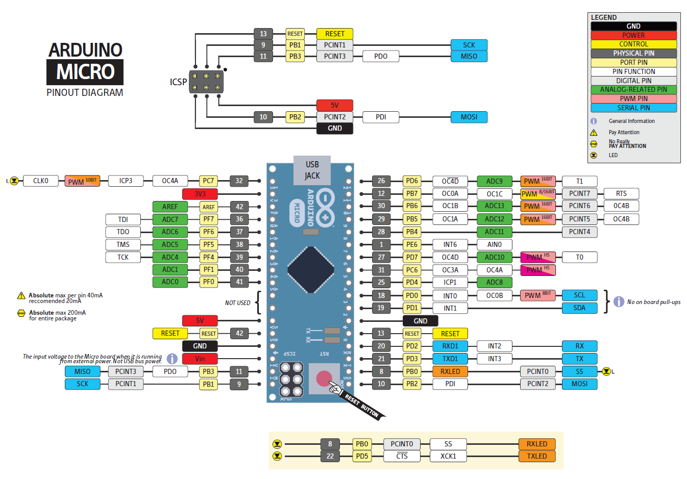
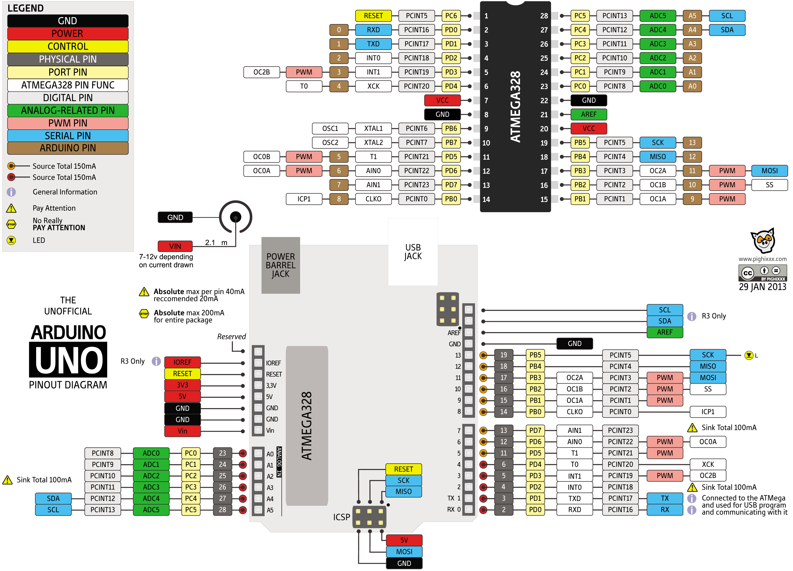
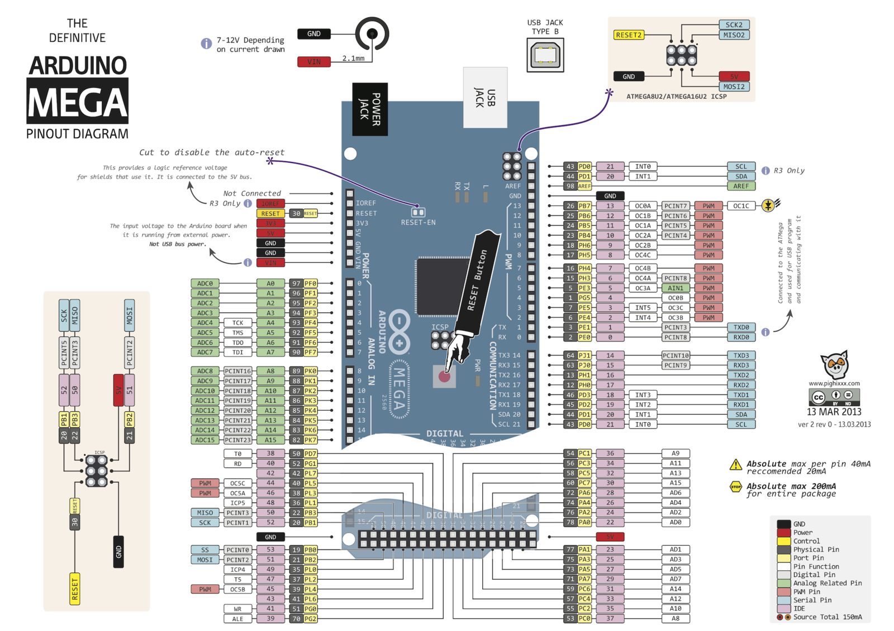
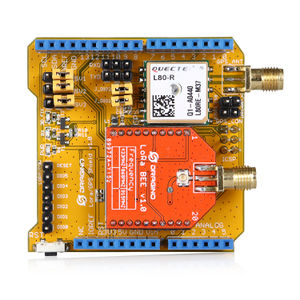
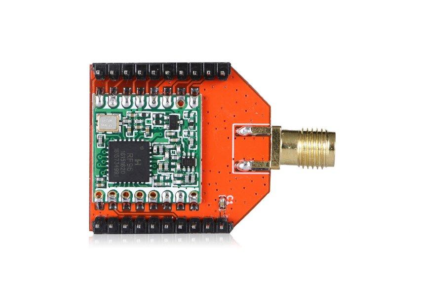
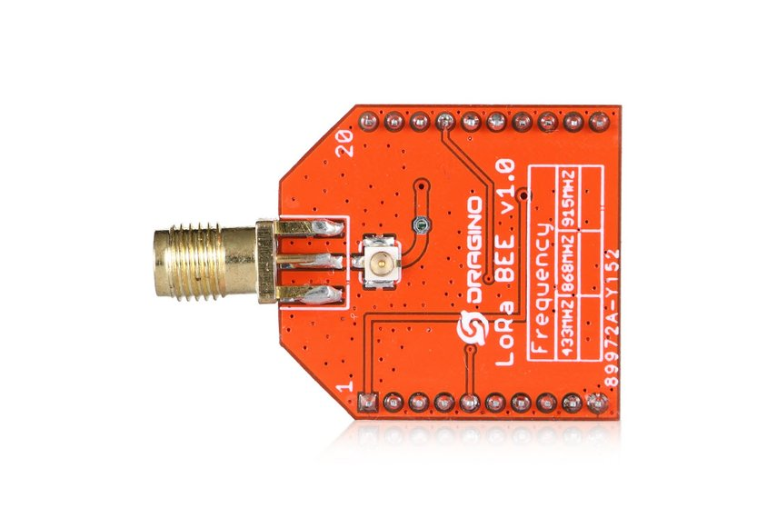
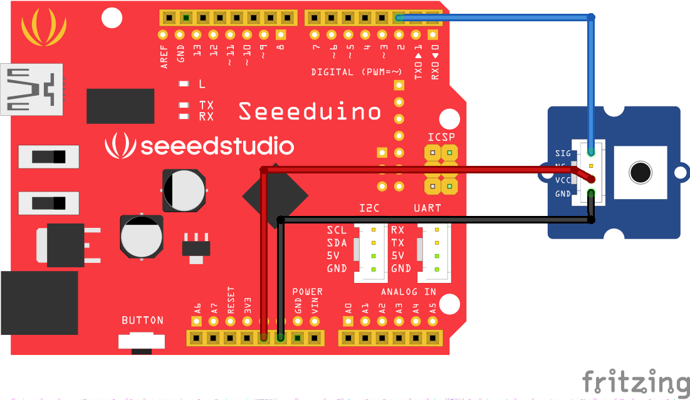

# Arduino <a name="12"></a>
Arduino — это электронный конструктор и удобная платформа быстрой разработки электронных устройств для новичков и профессионалов. Платформа пользуется огромной популярностью во всем мире благодаря удобству и простоте языка программирования, а также открытой архитектуре и программному коду. Устройство программируется через USB без использования программаторов.


**Плата Arduino**

Arduino позволяет компьютеру выйти за рамки виртуального мира в физический и взаимодействовать с ним. Устройства на базе  Arduino могут получать информацию об окружающей среде посредством различных датчиков, а также могут управлять различными исполнительными устройствами.

****
## Аппаратная часть платформы Arduino <a name="13"></a>
Существует несколько версий платформ Arduino. Uno, как и предыдущая версия Duemilanove построены на микроконтроллере Atmel ATmega328. Старые версии платформы Diecimila и первая рабочая Duemilanoves были разработаны на основе Atmel ATmega168, более ранние версии использовали ATmega8. 
Arduino Mega2560, в свою очередь, построена на микроконтроллере ATmega2560.







****
## Подключение периферии <a name="14"></a>
Отличительной особенностью Arduino является наличие плат расширения, так называемых shields или просто «шилдов». Это дополнительные платы, которые ставятся подобно слоям бутерброда поверх Arduino, чтобы дать ему новые возможности. Так например, существуют платы расширения для подключения к локальной сети и интернету (Ethernet Shield), для управления мощными моторами (Motor Shield), для получения координат и времени со спутников GPS (модуль GPS) и многие другие.


**Принцип бутерброда**

Для Arduino существует огромное количество различных датчиков, позволяющих проводить различные эксперименты и собирать информацию об окружающей среде. Чтобы удобно

**Плата расширения GROVE**

****
## Сенсоры <a name="15"></a>
GROVE - это не только плата расширения, но и целая линейка датчиков и переферии. 
Для примера предлагается осуществить подключение двух датчиков.
Датчик угла поворота подключается к контакту A0 на плате GROVE. 
A - означает аналоговый вход микроконтроллера, а 0 - номер.


**Подключение датчика угла поворота**

При использовании аналогового сигнала, показания датчика передаются в виде переменного напряжения на сигнальном проводе. Сигнальное напряжение может принимать значение от 0 В до напряжения питания. 

### Преимущества и недостатки аналогового сигнала <a name="16"></a>

Преимуществом сенсоров с аналоговым сигналом является крайняя простота их использования с Arduino. Кроме того, поскольку показания датчика можно считывать «из коробки» всего одной командой, драгоценные килобайты памяти на микроконтроллере не расходуются на хранение алгоритма расшифровки протокола, присущего цифровым сенсорам.
Главным недостатком аналогового сигнала является неустойчивость к внешним шумам. Если провод от сенсора до микроконтроллера будет достаточно длинным, он начнёт работать как антенна и улавливать внешние электромагнитные поля: провод сам будет влиять на выходное напряжение и тем самым искажать показания. Поэтому разумный предел длины провода для аналогового сенсора — не более 50 с.Чтобы уменьшить влияние помех на полезный сигнал можно воспользоваться усреднением. Так как помехи носят случайный характер, они будут влиять на полезный сигнал тем меньше, чем больше выборок используется для усреднения.
****
Вторым будет датчик температуры. Подключаем его к контакту A1.


**Датчик температуры**

****

### Преимущества и недостатки цифрового сигнала <a name="17"></a>

Преимуществом сенсоров с цифровым сигналом и всего двумя состояниями является крайняя простота их использования с Arduino.
Однако, если речь идёт о цифровом сенсоре с множеством градаций измеряемой величины, их использование с Arduino не так тривиально, как бинарных или аналоговых: необходимо реализовать расшифровку данных, что требует определённых усилий, а также занимает память микроконтроллера.
Поскольку возможных значений в цифровом сигнале всего 2, а возможные отклонения в напряжении «округляются» микроконтроллером в ближайшую сторону, такие сенсоры можно подключать с помощью достаточно длинных (много метров) проводов, не опасаясь искажения сигнала из-за влияния на провод внешних электромагнитных полей.


****
## Сборка примера <a name="20"></a>
Приступим к сборке демо-примера. Мы будем получать информацию с двух датчиков и отправлять ее по радиоканалу. Для этого нам потребуется следующий набор:


Берем плату Arduino UNO  и располагаем ее перед собой. 


На нее нужно установить плату Grove. 

Внимание! Убедитесь, что все ножки попали в соответствующие выводы на плате Arduino. Если соединить неправильно, то можно впоследствии сжечь микроконтроллер


Небольшим усилием соедининяем две платы до упора.


Далее берем датчик угла поворота.


Он подключается в любой из аналоговых выходов на плате GROVE. Подключим его к A0.


Аналогично подключаем датчик температуры к аналоговому выходу A1.

 
 
 

Передатчик подключается в цифровой вывод D2.

 

На этом сборка железной части завершена.

 

Теперь необходимо подключить Arduino к компьютеру и перейти к программированию

Подключение платы к компьютеру осуществляется через USB - разъем.

 


****
## Программирование <a name="21"></a>
Микроконтроллер на плате программируется при помощи языка Arduino (основан на языке Wiring) и среды разработки Arduino (основана на среде Processing). Проекты устройств, основанные на Arduino, могут работать самостоятельно, либо же взаимодействовать с программным обеспечением на компьютере (напр.: Flash, Processing, MaxMSP). 

### Arduino IDE <a name="22"></a>

Среда разработки Arduino состоит из встроенного текстового редактора программного кода, области сообщений, окна вывода текста(консоли), панели инструментов с кнопками часто используемых команд и нескольких меню. Для загрузки программ и связи среда разработки подключается к аппаратной части Arduino.


**Среда программирования Arduino IDE**

Программа, написанная в среде Arduino, называется скетч. Скетч пишется в текстовом редакторе, имеющем инструменты вырезки/вставки, поиска/замены текста. Во время сохранения и экспорта проекта в области сообщений появляются пояснения, также могут отображаться возникшие ошибки. Окно вывода текста(консоль) показывает сообщения Arduino, включающие полные отчеты об ошибках и другую информацию. Кнопки панели инструментов позволяют проверить и записать программу, создать, открыть и сохранить скетч, открыть мониторинг последовательной шины:

| Кнопка   |      Действие |
|----------|:-------------:|
|  |  Проверка программного кода на ошибки, компиляция. |
|  |    Компилирует программный код и загружает его в устройство Arduino.   |
|  | Открытие мониторинга последовательной шины (Serial monitor). |
### Структура программы на языке C++ для Arduino <a name="23"></a>
Рассмотрим простой пример мигания светодиодом:
```
void setup()
{
}
 
void loop()
{
}
```
В данном случае у нас 2 функции с именами setup и loop. Их присутствие обязательно в любой программе на C++ для Arduino.Они могут ничего и не делать, но должны быть написаны. Иначе на стадии компиляции вы получите ошибку.


# Технология LoRa

Технология LoRa - объединяет в себе метод модуляции LoRa в беспроводных сетях LPWAN и открытый протокол LoRaWAN.
Технология LoRa обеспечивает межмашинное взаимодействие (M2M) на расстояния до 15км при минимальном потреблении электроэнергии, обеспечивающем несколько лет автономной работы на одном аккумуляторе АА.
Диапазон применений данной технологии огромен: от домашней автоматизации и интернета вещей (Internet of Things, IoT) до промышленности и Умных Городов.
Подробнее о технологии можно прочитать, пройдя по ссылке: 
https://lo-ra.ru/lora/

Участникам хакатона будут выданы по два комплекта приемопередатчиков LoRa.
Один комплект состоит из [LoRa GPS-Shield] с установленным на нём модулем [LoRa BEE].

## Lora GPS-Shield

Dragino Lora/GPS Shield - это плата расширения для модуля LoRa™/GPS , устанавливаемая на Arduino Uno или на её аналог Seeduino. Этот шилд предназначан для тех, кто заинтересован в развитии и использовании LoRa™/GPS технологий.  Конструктивно Lora/GPS Shield состоит из собственно платы расширения и установленными на ней GPS-модуле и Lora BEE:




## Lora BEE

Dragino Lora BEE - это LoRa-модуль, позволяющий отправлять данные на ультра-дальние расстояния с высокой помехоустойчивостью, обеспечивая при этом минимальное энергопотребление.

Lora BEE основан на приемопередатчике [SX1276/SX1278]. Модуль Lora BEE предназначен для сложных распределенных сетевых систем таких как, умные города, различные сельскохозяйственные ирригационны системы, системы по поиску смартфонов и т.д.

Этот модуль может устанавливаться на посадочное место на плате расширения Lora/GPS Shield.
Ниже представлено изображение данного модуля:




Распиновка Lora BEE: 


Узнать подробнее о модуле можно пройдя по ссылке: https://wiki.dragino.com/index.php?title=Lora_BEE

[LoRa GPS-Shield]:<https://wiki.dragino.com/index.php?title=Lora/GPS_Shield>
[LoRa Bee]: <https://wiki.dragino.com/index.php?title=Lora_BEE>
[SX1276/SX1278]: <https://www.semtech.com/wireless-rf/rf-transceivers/sx1278/>

## Пример LoRa - Arduino

Ниже представлен код программы, обеспечивающий совместную работу платы Arduino и LoRa GPS-Shield. В этом примере GPS-модуль модуль не используется, плата раширения просто обеспечивает удобный монтаж задействованной LoRa BEE на Arduino.

Данный тестовый пример с определенной частотой посылает на хаб (некий центральный узел), который представлен платой Raspberry Pi, состояние подключенной кнопки. При этом осуществляется приём пакетов от RPi, в которых есть информация о том, зажечь ли светодиод или нет.

Кнопку можно можно подключить к любому цифровому пину. Считываение состояния осуществляется командой digitalRead().
Участникам хакатона будут выданы GROVE-кнопки или GROVE touch-кнопки. Подключаются они одинаково следующим образом:
VCC - к питанию на плате,
GND - к земле на плате,
SIG - к пину, с которого будет считываться состояние кнопки.

Примерно это выглядит так:



Для индикации используется L-светодиод, распаянный на плате. Он подключен к 13-ому пину. Для изменения его состояния используют функцию digitalWrite(13, LOW) или digitalWrite(13, HIGH).

### Код тестового примера

```
#include <SPI.h>
#include "SX1272.h"

// Define section
#define BAND868 //900, 433
#define MAX_NB_CHANNEL 9
#define STARTING_CHANNEL 10
#define ENDING_CHANNEL 18
uint8_t loraChannelIndex = 0;
uint32_t loraChannelArray[MAX_NB_CHANNEL] = {CH_10_868, CH_11_868, CH_12_868, CH_13_868, CH_14_868, CH_15_868, CH_16_868, CH_17_868, CH_18_868};
#define LORAMODE  1 //Mode
#define LORA_ADDR 6 //Self address
#define DEFAULT_DEST_ADDR 1201 //Gateway address

#define FLUSHOUTPUT               Serial.flush();

//Variables
int dest_addr = DEFAULT_DEST_ADDR;
char cmd[260] = "0";          // answer to RPi. Represents button state. 0 - free, 1 - reserved
const int SIGNAL_LED = 13;    // L-led on board
const int BUTTON_PIN = 2;     // button connected to pin 2
char sprintf_buf[100];.
int msg_sn = 0;
bool radioON = false;
uint8_t loraMode = LORAMODE;
uint32_t loraChannel = loraChannelArray[loraChannelIndex];
char loraPower = 'x'; //innitial poser level, M (maximum), H (high), L (low)
uint8_t loraAddr = LORA_ADDR;
unsigned int inter_pkt_time = 10000; //Time between sending
unsigned int random_inter_pkt_time = 0;
long last_periodic_sendtime = 0;


// Configure LoRa tranciever
void startConfig() {

  int e;

  // Set transmission mode and print the result
  e = sx1272.setMode(loraMode);
  // Select frequency channel
  if (loraMode == 11) {
    e = sx1272.setChannel(CH_18_868);
  }
  else {
    e = sx1272.setChannel(loraChannel);
  }
  // Select output power (Max, High or Low)
  e = sx1272.setPower(loraPower);
  // get preamble length
  e = sx1272.getPreambleLength();
  // Set the node address and print the result
  sx1272._nodeAddress = loraAddr;
  e = 0;
}

void setup() {
  int e;

  //Add our code here
  Serial.begin(38400);
  // Power ON the module
  e = sx1272.ON();

  e = sx1272.getSyncWord();

  if (!e) {
    radioON = true;
    startConfig();
  }

  FLUSHOUTPUT;
  delay(1000);

}

void loop() {
  
  int e;

  if (radioON) {

    // Arduino periodically sends button state
    if (inter_pkt_time)

      if (millis() - last_periodic_sendtime > (random_inter_pkt_time ? random_inter_pkt_time : inter_pkt_time)) {
        sx1272.CarrierSense();
        long startSend = millis();
        cmd[0] = digitalRead(BUTTON_PIN) + '0';                                             // write button state
        e = sx1272.sendPacketTimeout(dest_addr, (uint8_t*) cmd, strlen(cmd), 10000);   // send packet
        if (random_inter_pkt_time) {
          random_inter_pkt_time = random(1000, inter_pkt_time);
        }
        last_periodic_sendtime = millis();
      }

    e = 1;
    // trying to receive packet
    uint16_t w_timer = 1000;
    if (loraMode == 1)
      w_timer = 5000;
    e = sx1272.receivePacketTimeout(w_timer);

    // if packet was received?
    if (!e) {
      int a = 0, b = 0;
      uint8_t tmp_length;

      sx1272.getSNR();
      sx1272.getRSSIpacket();
      tmp_length = sx1272._payloadlength;
      if (tmp_length) {
        if ((char) sx1272.packet_received.data[0] == "0") {
          digitalWrite(SIGNAL_LED, LOW);
        } else {
          digitalWrite(SIGNAL_LED, HIGH);
        }
      }

    }

  }
}


```
