# Arduino <a name="12"></a>
Arduino — это электронный конструктор и удобная платформа быстрой разработки электронных устройств для новичков и профессионалов. Платформа пользуется огромной популярностью во всем мире благодаря удобству и простоте языка программирования, а также открытой архитектуре и программному коду. Устройство программируется через USB без использования программаторов.

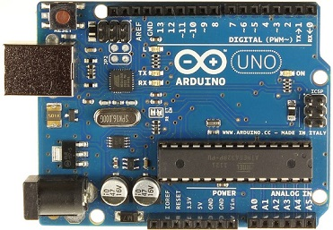
**Плата Arduino**

Arduino позволяет компьютеру выйти за рамки виртуального мира в физический и взаимодействовать с ним. Устройства на базе  Arduino могут получать информацию об окружающей среде посредством различных датчиков, а также могут управлять различными исполнительными устройствами.

****
## Аппаратная часть платформы Arduino <a name="13"></a>
Существует несколько версий платформ Arduino. Uno, как и предыдущая версия Duemilanove построены на микроконтроллере Atmel ATmega328. Старые версии платформы Diecimila и первая рабочая Duemilanoves были разработаны на основе Atmel ATmega168, более ранние версии использовали ATmega8. 
Arduino Mega2560, в свою очередь, построена на микроконтроллере ATmega2560.

****
## Подключение периферии <a name="14"></a>
Отличительной особенностью Arduino является наличие плат расширения, так называемых shields или просто «шилдов». Это дополнительные платы, которые ставятся подобно слоям бутерброда поверх Arduino, чтобы дать ему новые возможности. Так например, существуют платы расширения для подключения к локальной сети и интернету (Ethernet Shield), для управления мощными моторами (Motor Shield), для получения координат и времени со спутников GPS (модуль GPS) и многие другие.

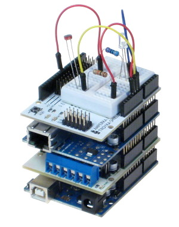
**Принцип бутерброда**

Для Arduino существует огромное количество различных датчиков, позволяющих проводить различные эксперименты и собирать информацию об окружающей среде. Чтобы удобно

**Плата расширения GROVE**

****
## Сенсоры <a name="15"></a>
GROVE - это не только плата расширения, но и целая линейка датчиков и переферии. 
Для примера предлагается осуществить подключение двух датчиков.
Датчик угла поворота подключается к контакту A0 на плате GROVE. 
A - означает аналоговый вход микроконтроллера, а 0 - номер.

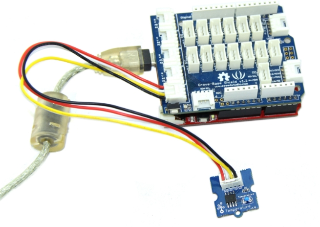
**Подключение датчика угла поворота**

При использовании аналогового сигнала, показания датчика передаются в виде переменного напряжения на сигнальном проводе. Сигнальное напряжение может принимать значение от 0 В до напряжения питания. 

### Преимущества и недостатки аналогового сигнала <a name="16"></a>

Преимуществом сенсоров с аналоговым сигналом является крайняя простота их использования с Arduino. Кроме того, поскольку показания датчика можно считывать «из коробки» всего одной командой, драгоценные килобайты памяти на микроконтроллере не расходуются на хранение алгоритма расшифровки протокола, присущего цифровым сенсорам.
Главным недостатком аналогового сигнала является неустойчивость к внешним шумам. Если провод от сенсора до микроконтроллера будет достаточно длинным, он начнёт работать как антенна и улавливать внешние электромагнитные поля: провод сам будет влиять на выходное напряжение и тем самым искажать показания. Поэтому разумный предел длины провода для аналогового сенсора — не более 50 с.Чтобы уменьшить влияние помех на полезный сигнал можно воспользоваться усреднением. Так как помехи носят случайный характер, они будут влиять на полезный сигнал тем меньше, чем больше выборок используется для усреднения.
****
Вторым будет датчик температуры. Подключаем его к контакту A1.

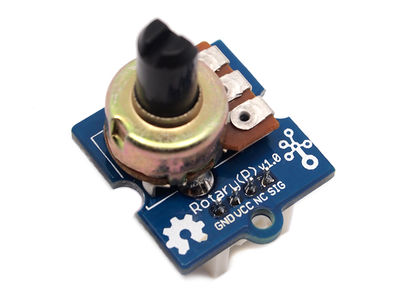
**Датчик температуры**

****

### Преимущества и недостатки цифрового сигнала <a name="17"></a>

Преимуществом сенсоров с цифровым сигналом и всего двумя состояниями является крайняя простота их использования с Arduino.
Однако, если речь идёт о цифровом сенсоре с множеством градаций измеряемой величины, их использование с Arduino не так тривиально, как бинарных или аналоговых: необходимо реализовать расшифровку данных, что требует определённых усилий, а также занимает память микроконтроллера.
Поскольку возможных значений в цифровом сигнале всего 2, а возможные отклонения в напряжении «округляются» микроконтроллером в ближайшую сторону, такие сенсоры можно подключать с помощью достаточно длинных (много метров) проводов, не опасаясь искажения сигнала из-за влияния на провод внешних электромагнитных полей.
****

## Радиоканал <a name="18"></a>
Для организации беспроводной связи в данном проекте используются радиомодули RF 315/433. Радиопередатчик подключаем к цифровому выходу D2 платы расширения GROVE.


**Радиоканал**

****
### Технические характеристики модуля <a name="19"></a>

-   Рабочее напряжение: 3 В - 12 В. Чем больше напряжение, тем больше мощность передатчика.
-   Рабочая сила тока: максимально - 40 мА, минимально - 9 мА.
-   мобильных сервисов, в том числе: push-уведомлений, Cloud Code,     Mobile Application Management, Mobile Quality Assurance;
-   Режим резонанса: (SAW).
-   Режим модуляции: ASK.
-   Рабочий частотный диапазон: 315 МГц или 433 МГц.
-   Мощность: 25 мВ (315 МГц при 12 В).
-   Погрешность частот: +150 кГц (макс.).
-   Скорость: не больше 10 Кб/с.

****
## Сборка примера <a name="20"></a>
Приступим к сборке демо-примера. Мы будем получать информацию с двух датчиков и отправлять ее по радиоканалу. Для этого нам потребуется следующий набор:

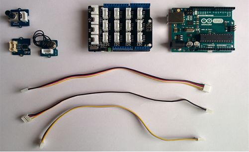

Берем плату Arduino UNO  и располагаем ее перед собой. 

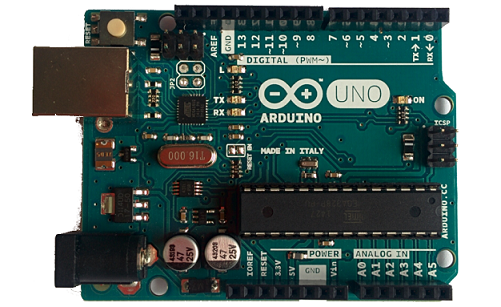

На нее нужно установить плату Grove. 

Внимание! Убедитесь, что все ножки попали в соответствующие выводы на плате Arduino. Если соединить неправильно, то можно впоследствии сжечь микроконтроллер

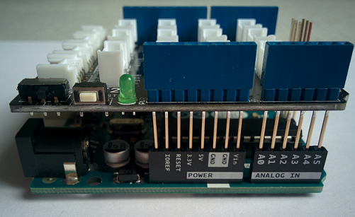

Небольшим усилием соедининяем две платы до упора.

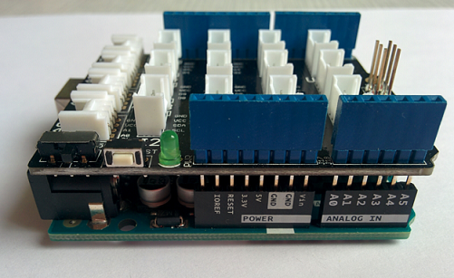

Далее берем датчик угла поворота.

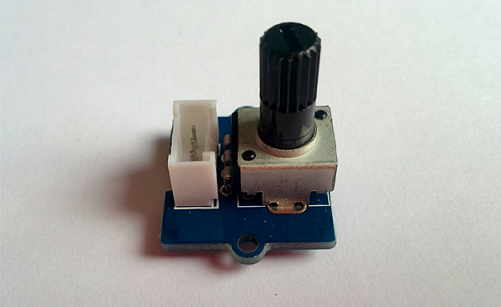

Он подключается в любой из аналоговых выходов на плате GROVE. Подключим его к A0.

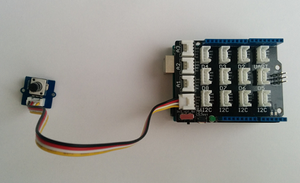

Аналогично подключаем датчик температуры к аналоговому выходу A1.

 
 
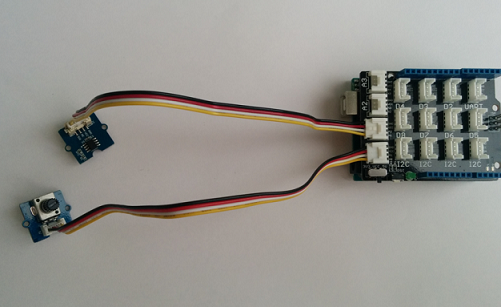 

Передатчик подключается в цифровой вывод D2.

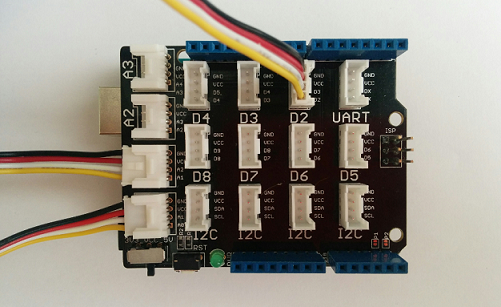 

На этом сборка железной части завершена.

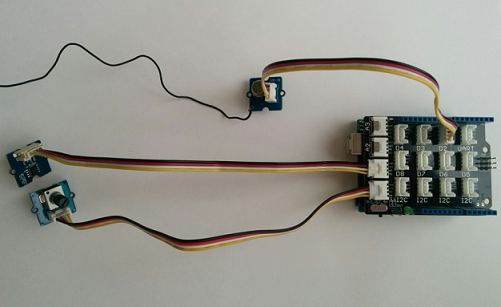 

Теперь необходимо подключить Arduino к компьютеру и перейти к программированию

Подключение платы к компьютеру осуществляется через USB - разъем.

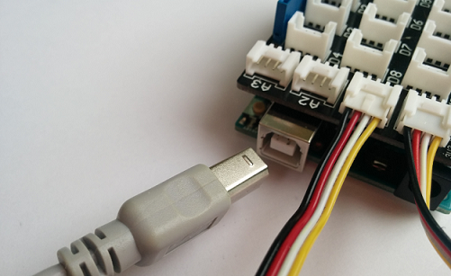 

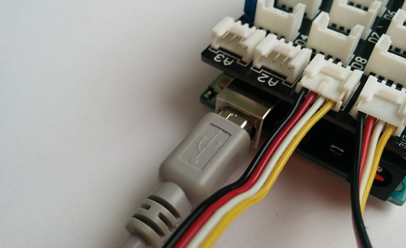

****
## Программирование <a name="21"></a>
Микроконтроллер на плате программируется при помощи языка Arduino (основан на языке Wiring) и среды разработки Arduino (основана на среде Processing). Проекты устройств, основанные на Arduino, могут работать самостоятельно, либо же взаимодействовать с программным обеспечением на компьютере (напр.: Flash, Processing, MaxMSP). 

### Arduino IDE <a name="22"></a>

Среда разработки Arduino состоит из встроенного текстового редактора программного кода, области сообщений, окна вывода текста(консоли), панели инструментов с кнопками часто используемых команд и нескольких меню. Для загрузки программ и связи среда разработки подключается к аппаратной части Arduino.


**Среда программирования Arduino IDE**

Программа, написанная в среде Arduino, называется скетч. Скетч пишется в текстовом редакторе, имеющем инструменты вырезки/вставки, поиска/замены текста. Во время сохранения и экспорта проекта в области сообщений появляются пояснения, также могут отображаться возникшие ошибки. Окно вывода текста(консоль) показывает сообщения Arduino, включающие полные отчеты об ошибках и другую информацию. Кнопки панели инструментов позволяют проверить и записать программу, создать, открыть и сохранить скетч, открыть мониторинг последовательной шины:

| Кнопка   |      Действие |
|----------|:-------------:|
|  |  Проверка программного кода на ошибки, компиляция. |
|  |    Компилирует программный код и загружает его в устройство Arduino.   |
|  | Открытие мониторинга последовательной шины (Serial monitor). |
### Структура программы на языке C++ для Arduino <a name="23"></a>
Рассмотрим простой пример мигания светодиодом:
```
void setup()
{
}
 
void loop()
{
}
```
В данном случае у нас 2 функции с именами setup и loop. Их присутствие обязательно в любой программе на C++ для Arduino.Они могут ничего и не делать, но должны быть написаны. Иначе на стадии компиляции вы получите ошибку.

### Написание программы для отправки данных сенсоров по радиоканалу <a name="24"></a>

В первую очередь задаем в коде константу GROUP_ID с номером вашей группы. Это ваш уникальный идентификатор в радиоканале. Так как все передатчики работают на одной частоте, то в первую очередь необходимо выделять среди прочих данные именно с ваших датчиков. 
Например, для первой группы это делается следующим образом: 

```
#define GROUP_ID 1 
```
Для работы с радиомодулем нужно подключить библиотеку RCSwitch.
```
#include "RCSwitch.h"
RCSwitch sender = RCSwitch();
```

В setup() производим включение радиомодуля, подключенного к контакту D2 платы GROVE.
```
#define TRANSMITTER_PIN 2
void setup() {
  sender.enableTransmit(TRANSMITTER_PIN);
  sender.setRepeatTransmit(4);
}
```
Для считывания значений аналогового датчика температуры используется стандартная функция analogRead()
#### Синтаксис <a name="25"></a>
analogRead(pin)
#### Параметры <a name="26"></a>
pin: номер порта аналогового входа с которого будет производиться считывание (0..5 для большинства плат, 0..7 для Mini и Nano и 0..15 для Mega)
#### Возвращаемое значение <a name="27"></a>
int (0 to 1023)
#### Замечание <a name="28"></a>
Если аналоговый вход не подключен, то значения возвращаемые функцией analogRead() могут принимать случайные значения.

Код для датчика температуры:
```
#define TEMPERATURE_SENSOR A1

#define B 3975 // идентификатор используемого термистора
int getTemperature() {
  int value = analogRead(TEMPERATURE_SENSOR);
  float resistance = (float)(1023 - value) * 10000 / value;
  float temperature = 1 / (log(resistance / 10000) / B + 1/298.15) - 273.15;
  return temperature;
}
```

Код для датчика угла поворота:
```
#define ROTARY_ANGLE_SENSOR A0

#define ADC_REF 5 // значение питания платы Arduino 5V
#define FULL_ANGLE 300 // Максимальное значение угла поворота
#define GROVE_VCC 5 // значение питания платы GROVE 5V

int getAngle() {
  int value = analogRead(ROTARY_ANGLE_SENSOR);
  float voltage = (float)value * ADC_REF / 1023;
  return voltage * FULL_ANGLE / GROVE_VCC;
}
```
Функция для кодирования сообщения, передаваемого по радиоканалу.

```
/*
Формат данных:
  group - идентификатор вашей группы
  n - номер датчика
  data - текущее показание
*/
unsigned long encode(byte group, byte n, int data) {
  return (unsigned long)group << 24 | (unsigned long)n << 16 | data & 0xffff;
}
```

Основной цикл программы:
```
#define GROUP_ID 1
void loop() {
  int temp = getTemperature(); // считывание значения температуры
  int degree = getAngle();     // считывание значения угла поворота
  sender.send(encode(GROUP_ID, 0, temp), 32); //кодирование и отправка температуры
  delay(500); // задержка 500 мс
  sender.send(encode(GROUP_ID, 1, degree), 32); //кодирование и отправка угла поворота
  delay(500); 
}
```

Полный код тестовой программы для Arduino:
```
#include "RCSwitch.h"

#define GROUP_ID 1 // идентификатор вашей группы
#define TRANSMITTER_PIN 2 // номер контакта, к которому подключен передатчик (D2)
#define TEMPERATURE_SENSOR A1 // номер контакта, к которому подключен датчик температуры
#define ROTARY_ANGLE_SENSOR A0 // номер контакта, к которому подключен датчик угла поворота 


RCSwitch sender = RCSwitch();

/*
Формат данных:
  group - идентификатор вашей группы
  n - номер датчика
  data - текущее показание
*/
unsigned long encode(byte group, byte n, int data) {
  return (unsigned long)group << 24 | (unsigned long)n << 16 | data & 0xffff;
}

#define B 3975 // идентификатор используемого термистора
int getTemperature() {
  int value = analogRead(TEMPERATURE_SENSOR);
  float resistance = (float)(1023 - value) * 10000 / value;
  float temperature = 1 / (log(resistance / 10000) / B + 1/298.15) - 273.15;
  return temperature;
}

#define ADC_REF 5 // значение питания платы Arduino 5V
#define FULL_ANGLE 300 // Максимальное значение угла поворота
#define GROVE_VCC 5 // значение питания платы GROVE 5V

int getAngle() {
  int value = analogRead(ROTARY_ANGLE_SENSOR);
  float voltage = (float)value * ADC_REF / 1023;
  return voltage * FULL_ANGLE / GROVE_VCC;
}

void setup() {
  sender.enableTransmit(TRANSMITTER_PIN);
  sender.setRepeatTransmit(4);
}

void loop() {
  int temp = getTemperature(); // считывание значения температуры
  int degree = getAngle();     // считывание значения угла поворота
  sender.send(encode(GROUP_ID, 0, temp), 32); //кодирование и отправка температуры
  delay(500); // задержка 500 мс
  sender.send(encode(GROUP_ID, 1, degree), 32); //кодирование и отправка угла поворота
  delay(500); 
}

```
