## Raspberry Pi <a name="29"></a>
> Raspberry Pi — одноплатный компьютер размером с банковскую карту, изначально разработанный как бюджетная система для обучения информатике, 
впоследствии получивший намного более широкое применение и популярность, чем ожидали его авторы. 
>

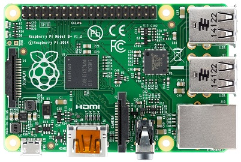
**Raspberry PI**

### Описание
На плате размером с кредитную карту вы найдёте всё то, что можете найти в обычном персональном компьютере: процессор, оперативную память, 
разъёмы HDMI, USB, Ethernet, аналоговые аудио- и видеовыходы. Кроме того, на плате расположены 40 контактов ввода/вывода общего назначения. К 
ним вы сможете подключать периферию для взаимодействия с внешним миром: исполнительные устройства вроде реле и сервомоторов или же любые 
сенсоры; в общем всё, что работает от электричества.

Штатной операционной системой для Raspberry Pi является Linux. Она устанавливается на micro-SD карту, а та в свою очередь — в специальном 
слоте на плате. Если вы не знаете Linux, не стоит пугаться. Напротив: этот компьютер — прекрасная возможность во всём разобраться. Потерять 
данные или сильно напортачить с настройками не так страшно, ведь образ на SD-карте можно восстановить за считанные минуты. После этого можно 
продолжить эксперименты с чистого листа или с определённой контрольной точки.

#### Порты и аппаратные интерфейсы
Для подключения монитора или телевизора используются композитный видеовыход или разъём HDMI. Кроме того, заводские OEM ЖК-экраны могут быть 
подключены через интерфейс DSI.
Raspberry Pi 2 Model B предоставляет 4 USB-порта, объединённых внутренним хабом. К ним, помимо всего прочего, можно подключить клавиатуру и 
мышь.

В качестве низкоуровневых интерфейсов доступны:

- 40 портов ввода-вывода общего назначения
- UART (Serial)
- Шина I²C/TWI
- Шина SPI с селектором между двумя устройствами
- Пины питания: 3,3 В, 5 В и земля

Колонки или наушники могут быть подключены через стандартное гнездо для 3,5 мм джеков. Также звук может передаваться через интерфейс HDMI.
На Raspberry Pi Model B+ доступен Ethernet-адаптер на 10/100 Мбит с выходом на стандартное гнездо 8P8C (RJ45).

#### Распиновка платы

**Распиновка Raspberry**

#### Питание
Raspberry Pi Model B+ может быть запитана через microUSB-кабель или через пины питания.
Номинальное напряжение питания — 5 В. Компьютер потребляет до 800 мА без внешних устройств.
Аппаратный выключатель питания на плате отсутствует. Для включения компьютера достаточно просто подсоединить кабель питания. Для выключения 
используйте штатную функцию операционной системы.

****
### Сборка примера

Приступим к продолжению сборки нашего демо-примера. Мы уже научились отправлять значения датчиков по радиоканалу. Теперь нам необходимо 
научится принимать эти данные, причем не путая их с чужими!

Нам необходимо следующее оборудование:

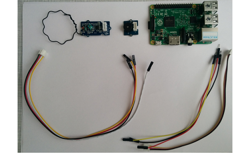

Берем Raspberry и аккуратно достаем карту памяти из прозрачного бокса.

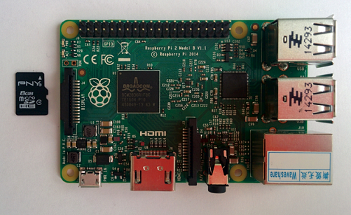

Прежде всего нужно установить SD-карту с операционной системой Raspbian в соответствущее гнездо на плате Raspberry. В гнезде плата фиксируется 
благодаря блокирующему механизму. Для надежного закрепления нужно аккуратно вдавить пальцем карту в гнездо.

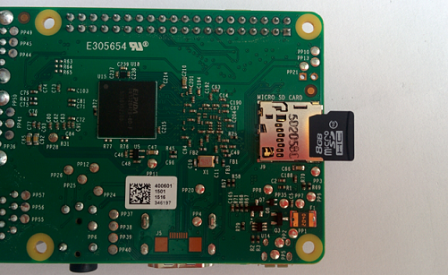

Raspberry должна принимать данные с Arduino по радиоканалу, поэтому нам нужно установить на нее приемник.

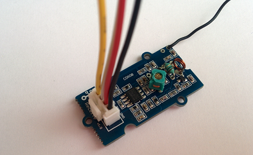

Подключение осуществляется согласно распиновке датчика: красный провод (+) - 2-ой пин, черный (земля) - 3-ий, а желтый (сигнал) - 13-ый 
(GPIO27). Белый провод не используется.

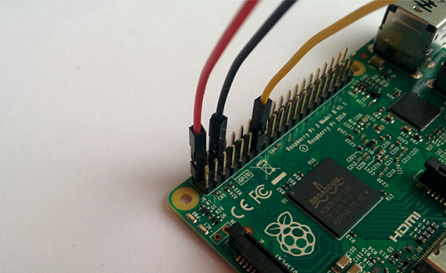

Должно получиться вот так:

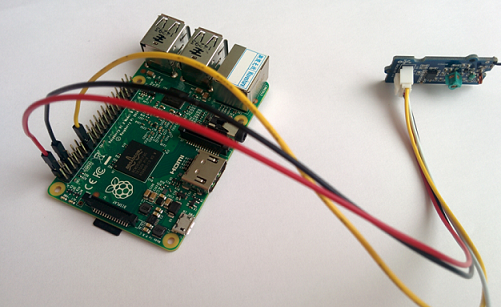

Для нашего примера необходимо также подключить пьезоизлучатель.

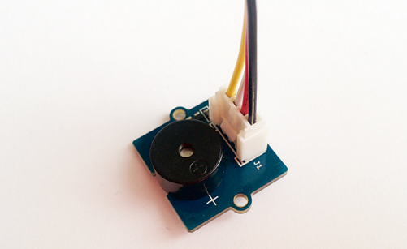

Подключение осуществляется по схеме: красный провод (+) - 4-ый пин, черный (земля) - 14-ый пин, а желтый (сигнал) - 15-ый (GPIO22). Белый 
провод не используется.

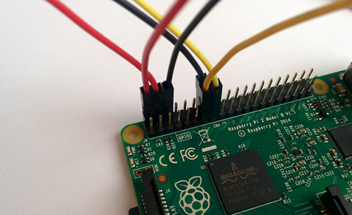

Raspberry будет требоваться доступ в интернет для связи с серверами IBM, поэтому мы должны подключить ethernet-кабель в соответствующее 
гнездо. 
Кроме того, мы будем подключаться к плате через SSH соединение.

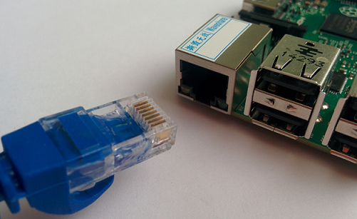


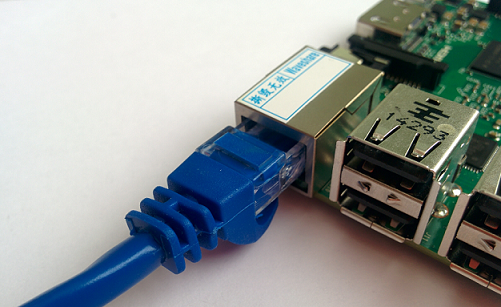

Питание платы осуществляется через mini-usb провод.

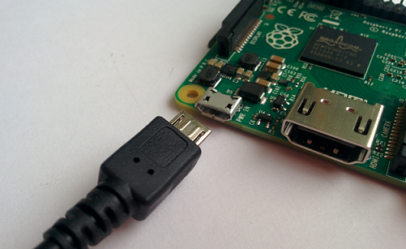

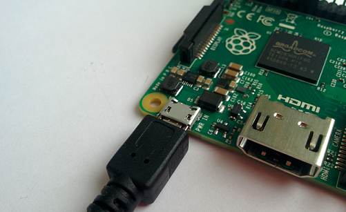

***
### Настройка SSH соединения с Raspberry Pi

Используя ОС Linux выполнить подключение к RPi можно следующим образом:
```
ssh pi@XX.XX.XX.XX
```
где XX.XX.XX.XX - ранее определенный ip адрес устройства. 

Если вы работаете в ОС Windows, то вам нужно воспользоваться программой Putty.
В поле Имя хоста указываем ip адрес Raspberry в сети, порт 22 и тип подключения SSH.

Пароль пользователя pi: raspberry

***
### Полезные команды для работы в ОС Raspbian

-   "top" — запуск предустановленного в Raspbian диспетчера задач;
-   "sudo raspi-config" — запуск первоначального меню настроек;
-   "sudo passwd root" — создание пароля для пользователя root;
-   "startx" — запуск графической оболочки;
-   "sudo halt" — выключение RPi;
-   "logout" — выход из системы;
-   "sudo reboot" — перезагрузка RPi;
-   "cd" — переход в необходимую директорию, например, для перехода в директорию /etc/network/ - "cd /etc/network/"
-   "pwd" — путь до текущей директории;
-   "dir" — содержимое текущей директории;
-   "mkdir" — создание директории. Например, "mkdir /home/pitest/" создаст директорию "pitest";
-   "rmdir" — удаление директории. Например, "mdir /home/pitest/" - удаление директории "pitest";
-   "cat" — открыть файл для чтения. Например, "cat /etc/network/interfaces" покажет содержимое файла "interfaces";
-   "nano" — открыть файл для редактирования. Например, "nano
-   /etc/network/interfaces" откроет для редактирования файл "interfaces";
-   "ifconfig" — отобразит текущую конфигурацию сети;
-   "df" — выведет в консоли свободное и используемое дисковое пространство для всех разделов файловой системы;
-   "clear" — очистить экран терминала;
-   "Ctrl"+"Ins" — скопировать выделенное (текст);
-   "Shift"+"Ins" — вставить из буфера (текст);
-   "sudo" — выполнения команд c правами root пользователя. Например, это актуально, если вы зашли под пользователем "pi" и хотите из консоли 
отредактировать какой-нибудь системный файл - "sudo nano путь_до_файла";
-   "Ctrl"+"C" — остановка текущего действия/выход из консольного приложения;
-   "sudo apt-get update" — обновление списка доступных пакетов;
-   "sudo apt-get upgrade" — обновление установленных пакетов;
-   "sudo apt-get install" — установка необходимого пакета. Например, для
установки консольного браузера Links вводим "sudo apt-get install links".

***
### Программирование

В качестве языка программирования выбран Python из-за своего удобства работы как с датчиками, так и с серверами Bluemix.

в консоли SSH соединения с Raspberry делаем последовательно следующее:

Переход в ваш домашний каталог
```
cd ~
```
Создание папки для Хакатона
```
mkdir iot
```
Создание файла, в который будем писать код на Python и открытие его в стандартном редакторе nano.
```
nano raspberry.py
```

Теперь можем приступать к написанию программы. Полный код расположен после этого блока.

Данный раздел посвящён коммуникации с Arduino и Bluemix со стороны Raspberry Pi, для чего мы напишем скрипт на python. К сожалению, придётся использовать python 2 из-за библиотеки `pi_switch`.


### Получение данных с Arduino <a name="30"></a>
Для начала необходимо получить данные по радиоканалу. Вспомним формат передаваемых данных:
```
+----------+-----------+---------+
| group id | sensor id |  data   |
|  8 bits  |   8 bits  | 16 bits |
+----------+-----------+---------+
|<----------- 32 bits ---------->|
```

Для работы с радиоканалом нам потребуется использовать библиотеку `pi_switch`:
```python
from pi_switch import RCSwitchReceiver

receiver = RCSwitchReceiver()
receiver.enableReceive(2)
  ```

Так как нас интересует далеко не вся информация, необходимо перед декодированием пакета проверять номер группы:
```python
def check_group(packet):
    return (packet >> 24) == GROUP_ID
```

Так же нам потребуется функция для декодирования пакета, т.е. извлечения идентификатора датчика и данных с этого датчика. Данные с датчика хранятся в дополнительном коде, что необходимо учесть:
```python
def decode(packet):
    sid = (packet >> 16) & 0xff
    data = packet & 0xffff

    # Преобразование отрицательного значения.
    if data & 0x8000:
        data = data - 0x10000
    return sid, data
```

Взаимодействие с библиотекой происходит в неблокирующем стиле: данные накапливаются во внутреннем буфере, пока пакет не будет полностью получен, после чего данные могут быть обработаны:
```python
def receive_if_available():
    # Проверка наличия данных в буфере.
    if not receiver.available():
        return

    # Получение данных и сброс буфера.
    packet = receiver.getReceivedValue()
    receiver.resetAvailable()

    # Наш ли это пакет.
    if packet and check_group(packet):
        return decode(packet)
```


###Создание приложения в *Bluemix* <a name="31"></a>

Перейти по ссылке: https://bluemix.net/. Введите Ваш логин и пароль. Перейдите в раздел DASHBOARD. При необходимости создайте новое рабочнее пространство (например, `dev`).
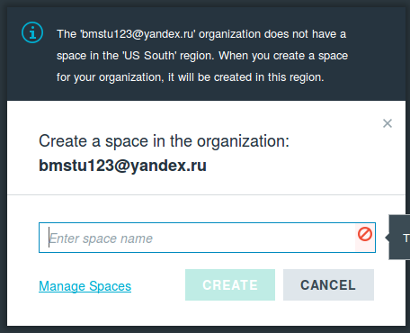

Перейдите в раздел CATALOG.

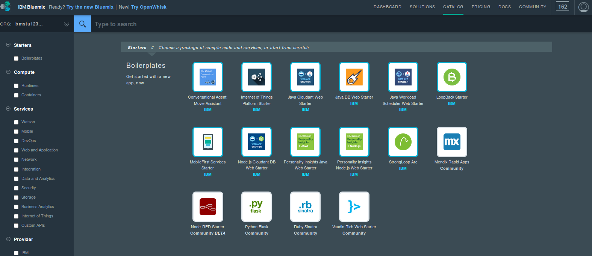
**Рабочее поле Bluemix.**

Добавьте в проект компонент Internet of Things Foundation Starter. 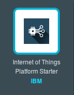
В результате буду добавлены приложение SDK for Node.js  и сервис Cloudant NoSQL DB.


После этого добавьте в проект сервис IoT Foundation. 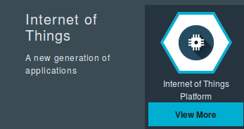
При создании в поле App укажите имя вашего приложения IoT Foundation Starter, что позволит автоматически связать SDK for Node.js с брокером MQTT.


Сервис IoT Foudation является интегрированным компонентом на основе брокера MQTT запросов. 
Для его использования необходимо выполнить конфигурацию брокера на прием пакетов от RaspberriPi.
Создадим описание нового устройства. В результате ваш проект будет иметь следующий вид.

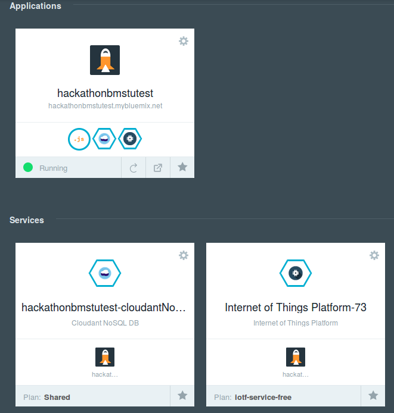
**Рабочее поле Bluemix после довбавление IoT Foundation и IoT Foundation Starter.**

Перейдите в раздел DASHBOARD. Запустите конфигурирование сервиса IoT Foundation (Launch dashboard).
Далее добавьте новое устройство (Add Device). 
Создайте новый тип устройства (например, с именем: RPi). Все поля за исключением поля Name можно оставить пустыми.

Для добавления устройства созданного Вами типа понадобится определить уникальный DeviceID устройства (например, его mac адрес).

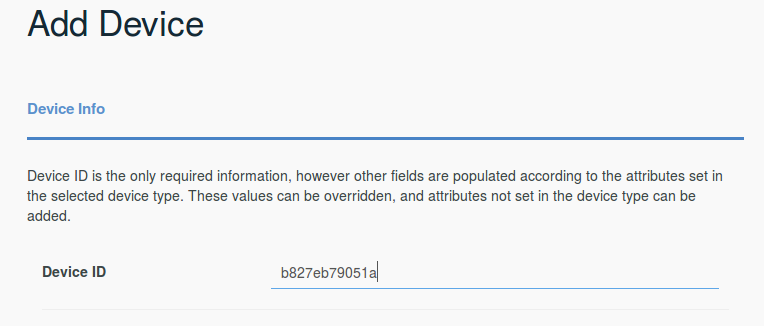

В следующем окне Вы можете выбрать один из двух вариантов: использовать автоматически сгенерированный токен или добавить существующий токен устройства. Выберем первый вариант (оставьте поле token пустым). В результате Вам будет выдана информация о настройках устройства, которые необходимо сохранить для последующего использования (см. следующее задание).

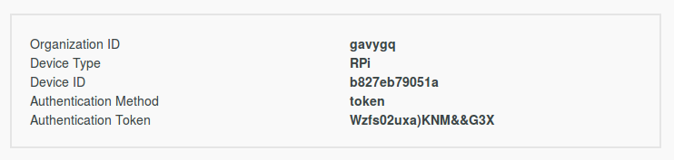


Полезной функцией IoT Foundation консоли является возможность просмотра логов сообщений MQTT. Данная возможность может быть использована для проверки работоспособности всей инфраструктуры, поиска ошибок и пр. 


### Отправка данных в *Bluemix* <a name="32"></a>
Для связи с Bluemix логично использовать протоколы, основанные на TCP или UDP. В данном примере используется MQTT.

После регистрации устройства в Bluemix мы получаем данные для авторизации, которые поместим в файл [device.cfg](src/device.cfg):
```ini
[device]
org=md8qpm
type=bmstu001
id=b827eb79051a
auth-method=token
auth-token=3BZu_drqRuAKH*K*+i
```

Bluemix предоставляет библиотеку ibmotf — небольшую обёртку над MQTT, инициализация соединения с которой выглядит как:
```python
import ibmiotf.device

def connect(config):
    options = ibmiotf.device.ParseConfigFile(config)
    client = ibmiotf.device.Client(options)
    client.connect()
    return client

client = connect('device.cfg')
```

После открытия соединения можно передавать данные, публикуя события:
```python
sid_to_topic = ['temperature', 'angle']

def send_data(sid, data):
    topic = sid_to_topic[sid]
    client.publishEvent(topic, 'json', data)
```

Теперь мы можем отправлять данные в облако по MQTT, получаемые с arduino по 433MHz-радиоканалу:
```python
def main():
    while True:
        payload = receive_if_available()
        if payload:
            sid, data = payload
            if 0 <= sid <= 1:
                send_data(sid, data)
            else:
                time.sleep(0.1)
```

Стоит заметить, что ждать необходимо только в отсутствии данных. Действительно, если ждать при любом исходе, то это может привести к накапливанию в буфере ненужных пакетов (полученных по ошибке) или в результате задержки на самой arduino.

### Получение данных из *Bluemix* <a name="33"></a>

В нашем случае нажатие на кнопку в веб-интерфейсе приведёт к гудку через динамик, подключённый к raspberry. Для работы с ним воспользуемся библиотекой `RPIO`.

Сконфигурируем GPIO-порт:
```python
import RPIO

BUZZER = 22
RPIO.setup(BUZZER, RPIO.OUT, initial=RPIO.LOW)
```

Теперь необходимо подписаться на получение данных из Bluemix:
```python
def connect(config):
    # ...
    client.commandCallback = on_message
    return client

def on_message(cmd):
    if cmd.command != 'button':
        return

    RPIO.output(BUZZER, 1)
    time.sleep(.05)
    RPIO.output(BUZZER, 0)

    print cmd
```

При инициализации соединения библиотека создаёт отдельный поток, в котором ожидаются поступающие события, называемые командами. После получения команды вызывается наш обработчик.

Полный код доступен [здесь](src/raspberry.py).
