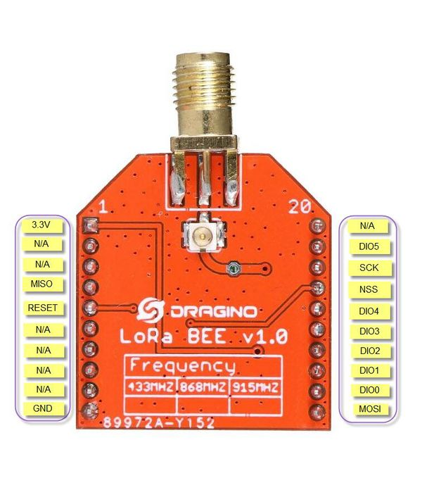
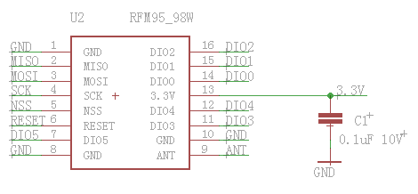

## Raspberry Pi <a name="29"></a>
> Raspberry Pi — одноплатный компьютер размером с банковскую карту, изначально разработанный как бюджетная система для обучения информатике, 
впоследствии получивший намного более широкое применение и популярность, чем ожидали его авторы. 
>


**Raspberry PI**

### Описание
На плате размером с кредитную карту вы найдёте всё то, что можете найти в обычном персональном компьютере: процессор, оперативную память, 
разъёмы HDMI, USB, Ethernet, аналоговые аудио- и видеовыходы. Кроме того, на плате расположены 40 контактов ввода/вывода общего назначения. К 
ним вы сможете подключать периферию для взаимодействия с внешним миром: исполнительные устройства вроде реле и сервомоторов или же любые 
сенсоры; в общем всё, что работает от электричества.

Штатной операционной системой для Raspberry Pi является Linux. Она устанавливается на micro-SD карту, а та в свою очередь — в специальном 
слоте на плате. Если вы не знаете Linux, не стоит пугаться. Напротив: этот компьютер — прекрасная возможность во всём разобраться. Потерять 
данные или сильно напортачить с настройками не так страшно, ведь образ на SD-карте можно восстановить за считанные минуты. После этого можно 
продолжить эксперименты с чистого листа или с определённой контрольной точки.

#### Порты и аппаратные интерфейсы
Для подключения монитора или телевизора используются композитный видеовыход или разъём HDMI. Кроме того, заводские OEM ЖК-экраны могут быть 
подключены через интерфейс DSI.
Raspberry Pi 2 Model B предоставляет 4 USB-порта, объединённых внутренним хабом. К ним, помимо всего прочего, можно подключить клавиатуру и 
мышь.

В качестве низкоуровневых интерфейсов доступны:

- 40 портов ввода-вывода общего назначения
- UART (Serial)
- Шина I²C/TWI
- Шина SPI с селектором между двумя устройствами
- Пины питания: 3,3 В, 5 В и земля

Колонки или наушники могут быть подключены через стандартное гнездо для 3,5 мм джеков. Также звук может передаваться через интерфейс HDMI.
На Raspberry Pi Model B+ доступен Ethernet-адаптер на 10/100 Мбит с выходом на стандартное гнездо 8P8C (RJ45).

#### Распиновка платы

**Распиновка Raspberry**

#### Питание
Raspberry Pi Model B+ может быть запитана через microUSB-кабель или через пины питания.
Номинальное напряжение питания — 5 В. Компьютер потребляет до 800 мА без внешних устройств.
Аппаратный выключатель питания на плате отсутствует. Для включения компьютера достаточно просто подсоединить кабель питания. Для выключения 
используйте штатную функцию операционной системы.

****
### Разбор тестового примера: 

Нам необходимо следующее оборудование:


Берем Raspberry и аккуратно достаем карту памяти из прозрачного бокса.


Прежде всего нужно установить SD-карту с операционной системой Raspbian в соответствущее гнездо на плате Raspberry. В гнезде плата фиксируется 
благодаря блокирующему механизму. Для надежного закрепления нужно аккуратно вдавить пальцем карту в гнездо.


### Настройка SSH соединения с Raspberry Pi

Используя ОС Linux выполнить подключение к RPi можно следующим образом:
```
ssh pi@XX.XX.XX.XX
```
где XX.XX.XX.XX - ранее определенный ip адрес устройства. 

Если вы работаете в ОС Windows, то вам нужно воспользоваться программой Putty.
В поле Имя хоста указываем ip адрес Raspberry в сети, порт 22 и тип подключения SSH.

Пароль пользователя pi: raspberry

***
### Как узнать адрес Raspberry?

* В Ubuntu выполните команду *sudo nmap –sn < ip-адрес компьютера >/< маска >*.  Пример:
 *sudo nmap -sn 192.168.1.0/24*
* В Windows скачайте любое приложение, сканирующее адреса (к примеру, Advanced IP Scanner). Просканируйте сеть, в которой находится компьютер.
* В списке найдите устройство с именем, подобным “Raspberry PI”.
Если вы обнаружите несоклько микрокомпьютеров “Raspberry PI” в вашей сети, вам понадобится узнать т.н. MAC адрес устройства - уникальный идентификатор сетевого устройства, состоящий из 6 байт. Узнать его можно по команде:

```shell
$ ifconfig
$ eth0      Link encap:Ethernet  HWaddr `28:d2:44:69:2a:c8` 
```

Также вы можете определить вашу плату по уникальному имени устройства `hostname` в файле /etc/hosname:
```shell
$ cat /etc/hostame
$ host10
```
В исключительном случае вы можете обнаружить вашу плату опытным путем, отключая и подключая свой Pi к сети.


***
### Полезные команды для работы в ОС Raspbian

-   "top" — запуск предустановленного в Raspbian диспетчера задач;
-   "sudo raspi-config" — запуск первоначального меню настроек;
-   "sudo passwd root" — создание пароля для пользователя root;
-   "startx" — запуск графической оболочки;
-   "sudo halt" — выключение RPi;
-   "logout" — выход из системы;
-   "sudo reboot" — перезагрузка RPi;
-   "cd" — переход в необходимую директорию, например, для перехода в директорию /etc/network/ - "cd /etc/network/"
-   "pwd" — путь до текущей директории;
-   "dir" — содержимое текущей директории;
-   "mkdir" — создание директории. Например, "mkdir /home/pitest/" создаст директорию "pitest";
-   "rmdir" — удаление директории. Например, "mdir /home/pitest/" - удаление директории "pitest";
-   "cat" — открыть файл для чтения. Например, "cat /etc/network/interfaces" покажет содержимое файла "interfaces";
-   "nano" — открыть файл для редактирования. Например, "nano
-   /etc/network/interfaces" откроет для редактирования файл "interfaces";
-   "ifconfig" — отобразит текущую конфигурацию сети;
-   "df" — выведет в консоли свободное и используемое дисковое пространство для всех разделов файловой системы;
-   "clear" — очистить экран терминала;
-   "Ctrl"+"Ins" — скопировать выделенное (текст);
-   "Shift"+"Ins" — вставить из буфера (текст);
-   "sudo" — выполнения команд c правами root пользователя. Например, это актуально, если вы зашли под пользователем "pi" и хотите из консоли 
отредактировать какой-нибудь системный файл - "sudo nano путь_до_файла";
-   "Ctrl"+"C" — остановка текущего действия/выход из консольного приложения;
-   "sudo apt-get update" — обновление списка доступных пакетов;
-   "sudo apt-get upgrade" — обновление установленных пакетов;
-   "sudo apt-get install" — установка необходимого пакета. Например, для
установки консольного браузера Links вводим "sudo apt-get install links".

***
### Программирование

В качестве языка программирования выбран Python из-за своего удобства работы с базами данных и серверой частью.

в консоли SSH соединения с Raspberry делаем последовательно следующее:

Переход в ваш домашний каталог
```shell
$ cd ~
```
Создание папки для Хакатона
```shell
$ mkdir iot
$ cd iot
```
Создадим файл, в который будем писать код серверной части приложения на Python, а так же файл проекта, который содержит информацию о зависимостях, необходимых для приложения, и, содержащий код работы с базой данных и дополнительные функции:
```shell
$ touch server.py
$ touch utils.py
$ touch requirements.txt
$ mkdir templates
$ cd templates
$ touch index.html
```

Далее можно приступать к написанию кода сервера приложения:

Данная часть приложения забирает данные о состоянии парковочных мест из базы данных и отдает HTML страницу с их визуализацией по запросу при обращении к ip адресу устройства из браузера извне.

Для реализации отдачи HTML страницы с актуальными данными был выбран фреймворк [Flask](http://flask.pocoo.org/), с помощью которого можно постпроить серверное приложение в короткие сроки. Для работы с базой данных используется ORM ( модель объектно-реляционного отображения данных ) [peewee](http://docs.peewee-orm.com/en/latest/peewee/quickstart.html), которая позволяет работать с сущностями БД как с объектами.

Рассмотрим код, который нужно написать в файле server.py:
```
# coding: utf-8
from flask import Flask, render_template
from utils import *

# Конфигурация параметров приложения и сервера
app = Flask(__name__)
app.debug = True

CAR_PLACE_COUNT = 16
STATUS_FREE = 0
STATUS_RESERVED = 1

# Контроллер, обрабатывающий запросы по URL "/"
@app.route('/')
def status():
    query = Place.select()
    return render_template("index.html", places=query)

# Точка входа ( запуска ) сервера / приложения
if __name__ == '__main__':

    if not Place.table_exists():
        Place.create_table(True)

        # Изначальное заполнение базы данных
        for i in range(1, CAR_PLACE_COUNT + 1):
            Place.create(identifier=i, status=STATUS_FREE)

    app.run()

```

Код в utils.py:

```
# coding: utf-8
from peewee import *

# Конфигурация подключения SQLite базы данных к приложению
db = SqliteDatabase('places.db')

# Класс, описывающий структуру данных в БД: identifier - номер парковочного места, status - его статус
class Place(Model):
    identifier = IntegerField(unique=True)
    status = IntegerField()

    class Meta:
        database = db

# Метод, осуществляющий обновление парковочного места в базе данных
def update_status(identifier, status):
    if status == STATUS_FREE or status == STATUS_RESERVED:
        if  1 << identifier << CAR_PLACE_COUNT:
            query = Place.update(status=status).where(Place.identifier == identifier)
            query.execute()
        else:
            return False
    else:
        return False

    return True
```

Код в index.html: ([Пример работы с HTML кодом](http://www.w3schools.com/html/))
```
<!DOCTYPE html>
<html lang="en">
<head>
  <meta charset="UTF-8">
  <title>Car parking</title>
</head>
<body>
  <div class="container-fluid">
    <div class="row">
      <div class="offset-md-3 col-md-6 offset-sm-3 col-sm-6 offset-xs-3 col-xs-6 offset-lg-3 col-lg-6 car-table">
        <div class="row">
        
          {% if place.identifier % 4 == 0 and place.identifier != 16 %}
              
                <div class="col-md-3 col-sm-3 col-xs-3 col-lg-3 car-cell" data="{{place.identifier}}"> <div class="car-cell_inner  car-cell_inner__free"></div> </div> </div> <div class="row">
              
                <div class="col-md-3 col-sm-3 col-xs-3 col-lg-3 car-cell" data="{{place.identifier}}"> <div class="car-cell_inner car-cell_inner__reserved"></div> </div> </div> <div class="row">
              
          
              
                <div class="col-md-3 col-sm-3 col-xs-3 col-lg-3 car-cell" data="{{place.identifier}}"> <div class="car-cell_inner car-cell_inner__free"></div> </div>
              
                <div class="col-md-3 col-sm-3 col-xs-3 col-lg-3 car-cell" data="{{place.identifier}}"> <div class="car-cell_inner car-cell_inner__reserved"></div> </div>
              
          
        
        </div>
    </div>
  </div>
</body>
    <style media="screen">
      .car-table {
        padding-top: 2%;
      }
      .car-cell {
        padding: 1%;
        min-width: 10%;
        min-height: 10%;
        line-height: 10em;
      }
      .car-cell_inner {
        padding-top: 100%;
        min-width: 100%;
        min-height: 100%;
        box-shadow: 0 0 10px black;
        line-height: 10em;
        border: solid 2px $white;
        border-radius: 4%;
      }

      .car-cell_inner:hover {
        animation: shake 1.20s cubic-bezier(.36,.07,.19,.97) both;
        transform: translate3d(0, 0, 0);
        backface-visibility: hidden;
        perspective: 1000px;
      }

      .car-cell_inner__free {
        background-color: black;
      }

      .car-cell_inner__reserved {
        background-color: white;
      }

      @keyframes shake {
        10%, 90% {
          transform: translate3d(-1px, 0 , 0);
        }

        20%, 80% {
          transform: translate3d(2px, 0, 0);
        }

        30%, 50%, 70% {
          transform: translate3d(-4px, 0, 0);
        }

        40%, 60% {
          transform: translate3d(4px, 0, 0);
        }
      }

    </style>

    <link rel="stylesheet" href="https://maxcdn.bootstrapcdn.com/bootstrap/4.0.0-alpha.5/css/bootstrap.min.css">
</html>

```

Для запуска проекта необходимо развернуть [виртуальное окружение](http://docs.python-guide.org/en/latest/dev/virtualenvs/) и установить нужные зависимости:

Файл с python-зависимостями: requirements.txt

```
click==6.6
Flask==0.11.1
flask-peewee==0.6.7
itsdangerous==0.24
Jinja2==2.8
MarkupSafe==0.23
peewee==2.8.5
Werkzeug==0.11.11
wtf-peewee==0.2.6
WTForms==2.1

```

Для начала создадим и запустим виртуальное окружение:

```shell
$ sudo pip install virtualenv
$ virtualenv venv
$ source venv/bin/activate

```

Для деактивации рабочего окружения нужно восползоваться следующей командой:
```shell
$ deactivate
```

Виртуальное окружение нужно для того, чтобы в разных проектах разработчики могли использовать разные версии python и прилежащих библиотек по мере их использования.

Установка нужных зависимостей:


```shell
$ pip install -r requirements.txt
```

Для возможности импортирования функций из других Python файлов необходимо создать пустой файл __init__.py, лежащий на том же уровне файловой системы, что и файл, из которого планируется импорт какой-либо функции или класса:

```shell
$ touch __init__.py
```

Запуск сервера:

```shell
$ python server.py
```

Полный код доступен [здесь](https://github.com/bmstu-hackathon/2016/tree/master/src/Raspberry).


### Подключение LoRa к Raspberry 

На следующей картинке представлены выводы платы Lora Bee. 
 
Ее нужно подсоединить к Pi, схема ее выводов представлена ниже 
 
Подключение осуществляется по следующей схеме: 
#Lora — Raspberry 
* 3.3V — 3.3V 
* MISO — SPI0_MISO 
* GND — Ground 
* SCK — SPI0_SCLK 
* NSS — SPI0_CE0_N 
* MOSI — SPI0_MOSI

Если у вас плата с уже припаянными проводами, то руководствуйтесь следующей схемой:
 

### Взаимодействие с LoRa на Raspberry


ВНИМАНИЕ! НЕОБХОДИМО УСТАНОВИТЬ SQLITE3

`sudo apt-get install libsqlite3-dev`

`sudo apt-get install sqlite3`


Код программы для Pi находится по адресу

https://github.com/bmstu-hackathon/2016/tree/master/src/Raspberry/LeoNickTEAM

Сделайте git clone репозитория
`git clone https://github.com/bmstu-hackathon/2016.git`

Перейдите в указанную директорию
2016/src/Raspberry/LeoNickTEAM/

!!!!!!!!!!!!!
!!!!!!!!!!!!!!!!!!!ВНИМАНИЕ!!!!!!!!!!!!!!!!!!!!!!!!!!!
!!!!!!!!!!!!
в hackathon.cpp
СТРОКУ
int ide=sx1272.packet_received.src;
ЗАМЕНИТЬ НА
int ide=6;//sx1272.packet_received.src;


Последовательно вводим команды
* `sudo rm hackathon.o`
* `sudo rm hackathon`
* `sudo make hackathon`

* sudo ./hackathon # - Команда выполняется только после того как на Arduino будет запущен скеч лежащий в папке репозитория 
по адресу 2016/src/Arduino/hackathon_LeoNickTeam/

В файле hackathon.cpp находится код основной программы. Если будете его редактировать, повторите все 3 вышеописанные команды.
