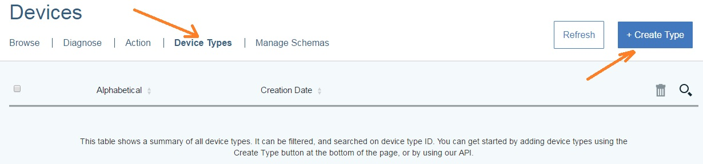

# Работа с IBM Bluemix <a name="401"></a>
## Регистрация в Bluemix <a name="402"></a>

Для начала переходим по ссылке https://console.ng.bluemix.net/.

В правом верхнем углу выбираем Sign UP.


Заполняем форму и создаем аккаунт. Переходим на почту, указанную при регистрации и подтверждаем свой аккаунт.
Затем выполняем вход в созданный аккаунт (Log In на стартовой странице Bluemix).
После входа всплывет окно:


Здесь надо выбрать, где будет расположено приложение,  а также ввести название организации. В качестве места расположения выберите US South. После выбора места и ввода названия организации, также будет предложено ввести имя пространства приложения, дадим имя пространству dev.
На этом регистрация и настройка аккаунта закончена.

## Создание приложения Node.js <a name="403"></a>

*Для данного этапа требуются установленные Node.js, Cloud Foundry CLI и Bluemix CLI. Подробности по ссылке https://console.ng.bluemix.net/docs/starters/install_cli.html*

Создадим примитивный вебсервер, используя Node.js.
Для этого создадим новую папку с предполагаемым именем будущего веб-приложения.(например mqttListener). Запускаем консоль Windows и переходим в только что созданную папку. Создадим файл app.js.(главный файл сервера) и  файл package.json, который будет содержать все зависимости (dependencies, названия необходимых пакетов). Это нужно для того, чтобы при сборке проекта в среде Bluemix, самой средой были установлены требуемые пакеты. Для создания package.json  прописать в консоли npm init и согласиться на все предложенные пункты без изменений (прим. В поле name недопустимы заглавные буквы).

Затем открываем любым текстовым редактором файл package и в поле scripts заменяем прописанное на:

    "start": "node ./app.js"
    
Это требуется для Bluemix, чтобы среда знала, какой файл запустить первым.
Для развертывания сервера будет использован npm пакет express. js (подробнее http://expressjs.com/) . Чтобы тестировать приложение на localhost, надо установить данный пакет. Для этого в консоли пропишем npm install express –save. Команда –save сразу запишет наш пакет в зависимости(dependencies) в файле package.json. При успешной установке появится папка node_modules.
В файле app.js пропишем:
```javascript
var express = require('express'),
	  app = express();


app.get('/', function (req, res) {
	 return res.send("App is working");
  });

//process.env.VCAP_APP_PORT for Bluemix instead of 3000
app.listen(process.env.VCAP_APP_PORT,function(){
	console.log("Start on 3000");
});
```
*Примечание: для того, чтобы приложение запускалось в Bluemix, первый параметр функции listen должен принимать значение process.env.VCAP_APP_PORT, однако для локального запуска сервера нужно прописать лишь номер порта, например 3000.*

Теперь наш мини-сервер готов к заливке в Bluemix.
Для начала надо залогиниться в Bluemix с помощью консоли Cloud Foundry.
Пропишем в консоли cf login. Затем вводим емейл и пароль нашего аккаунта при регистрации.


Затем, находясь в папке с нашим проектом пишем: cf push %НазваниеПроекта. 
 В моем случае cf push mqttListener.  *Примечание:  консоль может поругаться, что название уже занято, выберите незанятое.*
 
После данной команды будут произведены операции создания проекта в среде Bluemix, его сборка, а также запуск.
Если перейти по ссылке https://console.ng.bluemix.net/dashboard/applications, то можно увидеть, что теперь появилось новое приложение. Кликая по ссылке в разделе Route, можно убедиться, что приложение работает.

## Подключение сервиса Watson IOT <a name="404"></a>

В разделе All applications (https://console.ng.bluemix.net/dashboard/applications)  щелкнем по Create service:


Слева в разделе Services выберем Internet of Things и выберем сервис Internet of Things Platform:


Ничего не изменяя, кликаем на Create. В итоге попадем на панель IOT. Сервис IOT подключен. 

## Принципы обмена MQTT-сообщениями в Bluemix и создание MQTT Device и MQTT API key <a name="405"></a>

Сервис Watson IOT предоставляет встроенного MQTT брокера.

Обмен MQTT сообщениями в Bluemix осуществляется в соответствии со схемой:


**Пояснения к схеме.**

В среде Bluemix существует 2 вида MQTT клиентов, которые обмениваются сообщениями через брокера: device-клиент и application-клиент. У каждого из них свои принципы обмена сообщениями и для осуществления данных операций нужны разные реквизиты (credentials, о них будет рассказано ниже). Все MQTT-сообщения в Bluemix можно разделить на 2 вида: команды и непосредственная информация. Для обмена сообщениями MQTT брокер в Bluemix предоставляет 2 вида каналов, по одному на каждый вид сообщения: канал для команд (command thread) и канал для данных с датчиков (events thread).

Работа обоих видов клиентов начинается с подключения к брокеру, после этого каждый клиент может совершать операции, которые различаются в зависимости от типа клиента.

Клиенты-девайсы (датчики и т.п.) могут отправлять данные (publish events) на брокера по каналу данных и подписываться (subscribe) на канал команд, в который приходят команды от клиента-приложения.

Клиенты-приложения (в этой роли будет выступать наше веб приложение) могут подписываться (subscribe)на канал данных, которые приходят от датчиков, а также отправлять команды (publish commands) в канал команд.

Примечание: MQTT-сообщения, т.е. данные с датчиков и команды от приложений описаны в формате json. 
Пример данных с датчика:
```
{
	“sensorType” : ”temperature”,
	“value” : “25”
}
```
Пример команды от приложения:
```
{
	“command” : ”setMaxValue”
}
```
Итак, для того, чтобы работать с MQTT брокером, надо создать MQTT device и MQTT API key.

После создания сервиса в панели сервиса в разделе Connect your Devices выберите Launch dashboard. Откроется панель администрирования сервиса IOT.
На панели слева выбираем Devices. Далее нам нужно создать тип нашего будущего девайса. Для этого кликнем на Device types и затем на Create type:



Выбираем Create device type. В поле name вводим название типа нашего устройства – MQTTDevice. **_Важно: запомните название типа, оно будет использоваться далее._**
Далее оставляем все без изменений, нажимаем на Next и в итоге на Create. В результате создастся новый тип девайса, это отобразится на панели.

Теперь создадим непосредственный девайс с нашим свежесозданным типом. Для этого переходим во вкладку Browse и выбираем Add Device.
В появившемся окне кликаем по Choose Device Type, выбираем созданный тип и кликаем Next.
В поле Device ID запишем ID устройства (придумываем сами, например: aabbccddee12), кликаем Next->Next->Next->Add.

**_Важный этап: запишите реквизиты устройства(credentials), которые показались после нажатия на Add, больше _возможности их увидеть не будет._**

Таким образом, был добавлен девайс, к которому будут подключаться реальные устройства.


Теперь нужно создать API key для того, чтобы клиенты-приложения также могли подключаться к брокеру. На левой боковой панели выбираем раздел APPS. Затем кликаем по Generate API key.

**_Важно: запишите информацию о API key, позже ее невозможно будет снова увидеть._** Кликаем по Generate.

В результате этапа 4 были созданы реквизиты для подключения к брокеру клиента-девайса и клиента-приложения. 

## Этап 5. Описание подключения к MQTT брокеру и проверка передачи MQTT сообщений с помощью MQTTlens <a name="406"></a>

*Для более глубокого понимания можно прочитать статью https://www.ibm.com/developerworks/cloud/library/cl-mqtt-bluemix-iot-node-red-app/*

Подключение к брокеру использует аутентификацию.  
Для подключения к брокеру со стороны девайс-клиента нужны опции:

1) Hostname:  
```
tcp://< OrganizationID >.messaging.internetofthings.ibmcloud.com
```
OrganizationID – из реквизитов при создании девайса в сервисе IOT(см.этап 4)  


2) Client ID:  
```
d:< OrganizationID >:< DEVICETYPE >:< DEVICEID >
```
deviceType - созданный тип устройства.  
deviceID - ID созданного устройства.  

3) Username: use-token-auth

4) Password: < токен, полученный при создании девайса в сервисе IOT >


 
Подключение со стороны клиента-приложения:

1) Hostname: аналогично устройству  
2) Client ID:  
```
a:< OrganizationID >:< app-id >  
```
appID - идентификатор приложения. Может быть любым, например myApp  


3) Username: < API Key >  
Api Key - получили при создании ключа в IOT Platform в разделе APPS (см.этап 4).

4) Password: < токен, полученный при создании ключа в IOT Platform >  
  
  
После подключения к брокеру клиенты могут отправлять сообщения в каналы, либо подписываться на каналы.

Путь **канала данных для публикации(!)** устройством:  
```
iot-2/evt/<event-id>/fmt/<format>
```

EventID - любой идентификатор процесса ( например mySensor)  
format - формат переданного сообщения, в данном случае нужно json.  

**Для подписки(!)** на канал данных **со стороны приложения:**
```
iot-2/type/<type-id>/id/<device-id>/evt/<event-id>/fmt/<format-id>
```

type-id - название типа нашего устройства, например: MQTTDevice  
device-id  - идентификатор устройства, который можно найти в реквизитах девайса(credentials) из этапа 4.  
event-id  - eventId из пути публикации устройством.  
formatid - формат принятого сообщения, в данном случае json.  

**Для публикации клиентом-приложением(!)** команд в канал команд: 
```
iot-2/type/<type-id>/id/<device-id>/cmd/<cmd-id>/fmt/<format-id>  
```

type-id - название типа нашего устройства, например: MQTTDevice  
device-id  - идентификатор устройства, который можно найти в реквизитах девайса(credentials) из этапа 4.  
cmd-id – любой идентификатор команды, задаем сами (например getSmth)  
formatid - формат принятого сообщения, в данном случае json.  


**Для подписки** на канал команд **клиентом-девайсом**: 
```
iot-2/cmd/<cmd-id>/fmt/<format-id>.   
```

cmd-id – любой идентификатор команды, задаем сами (например getSmth).  
formatid - формат принятого сообщения, в данном случае json.  
  
  
Для проверки корректности передачи MQTT сообщений существует удобный сервис для Google Chrome- MQTTlens.  


После установки MQTTlens, создадим новое подключение (+ рядом с Connections):


Заполняя поля вышеописанным способом, создадим подключение сначала для девайс клиента, затем для клиента-приложения.  
Пример заполнения настроек (для клиента-девайса):  


Пример заполнения настроек (для клиента-приложения):


Затем подписываемся клиентом-приложением на команды, а клиентом-девайсом публикуем команды (в соответствии с описанным выше в начале этапа 5).  
В результате замечаем внизу окна принятые клиентом-приложением MQTT-сообщения:  


## Подключение сервиса Compose for MongoDB, краткое описание MongoDB и MongoShell, описание примера проекта для хакатона <a name="407"></a>

Перейдем по ссылке https://console.ng.bluemix.net/dashboard/applications. Выберем Create service.  
В списке сервисов выберем Data&Analytics и выберем в списке сервисов Compose for MongoDB. Ждем Create. Был создан сервис. Теперь надо подключить его к нашему приложению.  
Для этого во вкладке Connections:  


Выберите Create connection и выберите наше веб приложение. (При запросе на пересборку приложения выберите Restage). В итоге подключили сервер MongoDB к нашему веб-приложению. Следующим шагом следует скопировать реквизиты данного сервиса для подключения к базе данных через MongoShell и из нашего веб-приложения.  
Переходим во вкладку Service Credentials. Выбираем View credentials:  


Нас интересуют поля uri_cli и uri (в самом низу файла). **_Важно: uri используется для подключения к серверу Mongo из программы._**  
MongoDB – NonSQL база данных, которой записи хранятся в формате json.  
MongoShell – Оболочка, которая устанавливается при установке mongodb локально на компьютере. Оболочка позволяет подключаться к серверу MongoDB и выполнять основные операции: просмотр баз данных, создание баз данных, добавление новых записей в базы, очищение баз данных, создание и просмотр коллекций и тд. Подробнее с MongoDB и MongoShell можно ознакомиться на https://docs.mongodb.com/ и https://docs.mongodb.com/getting-started/shell/client/  
Рассмотрим подключение к созданному нам серверу Mongo с помощью MongoShell.  
Открываем консоль Windows и переходим в папку, куда установлена MongoDB. Открываем в консоли путь MongoDB\Server\3.2\bin. Затем пишем в консоль uri_cli, который скопировали из реквизитов сервиса Compose.  


Основные команды MongoShell:  
Show dbs – показывает все созданные базы данных на сервере Mongo.  
Use < dbName > - использовать базу данных dbName. Если базы данных dbName не существует, то она создастся (прим.  В списке баз данных она появится только если добавить в нее хотя бы 1 запись).  
Show collections – показывает коллекции из базы данных (подробнее читать на сайте mongo).  
Db.< collectionName >.find() – показать все записи коллекции collectionName.  
Db.< collectionName >.drop() – удалить все записи из коллекции collectionName.  

### Описание примера проекта с графиком <a name="408"></a>

Тестовый проект включает в себя вебсервер на Node.js, который взаимодействует с сервисами Watson IOT и Compose for MongoDB. По ссылке http://mqttlisteneriu.mybluemix.net/showChart показывает график, который отображает последние 10 хранимых в базе данных значений.

Формат отправки команд клиентом-девайсом:
```
{ 
"sensorType":"temperature", 
"sensorVal":"1" 
}
```

Структура проекта:
```
mqttListenerIU
	|__libs
	|       |__mongoose.js
	|
	|__public
	|	|__scripts
	|	|	|__script.js
	|	|
	|	|__styles
	|		|__button.css
	|
	|__app.js
	|__config.json
	|__dataChart.html
	|__package.json
```

App.js – основной файл проекта (подключение к брокеру, подписка на данные, публикация команд, описание GET-запросов);  
Config.js – файл конфигурации с используемыми реквизитами (клиентом-приложением);  
dataChart.html – вебстраница с графиком  
mongoose.js – файл с описанием схемы для модели mongoose, а также подключение к Mongo по URI (подробнее  читать http://mongoosejs.com/)  
script.js – файл с кодом отправки команды со стороны веб-клиента.  

### Описание примера проекта для проекта с парковкой <a name="409"></a>

  
Данный проект является частью проекта шаблонного проекта хакатона. 
В нем реализована та часть проекта, которая ответственна за бронирование парковочного места из браузера. Также в браузере показывается актуальная информация о доступности парковочных мест.  
Существует 3 возможных состояния парковочного места (в браузере отображаются квадратиками): "свободно" - зеленый цвет, "занято" - красный цвет, "зарезервированно" - желтый цвет.  
Тестовый проект включает в себя вебсервер на Node.js, который взаимодействует с сервисами Watson IOT и Compose for MongoDB. По ссылке http://(ваше_название_ приложения).mybluemix.net/ показывает парковку, который отображает стоянку  16ю парковочными местами. Цветом показывается текущее состояние места. Кликая на место, можно его зарезервировать (отправляется команда по MQTT).

Формат отправки команд клиентом-девайсом:
```
{ 
"commandName":"blocked", 
"lotID":"1_1" 
}
```
Возможные принимаемые значения полем commandName - "blocked", "free", "reserved".
Значения поля lotID - "1_1", "1_2", ... "4_4". (ID лота отсчитывается с левого верха и до низу, первая цифра - номер по горизонтали, вторая - по вертикали).
Структура проекта:
```
parkingServer
	|__libs
	|       |__mongoose.js
	|
	|__public
	|	|__scripts
	|		|__script.js
	|	
	|__app.js
	|__config.json
	|__parking.html
	|__package.json
```
Назначение файлов app.js, config.json, package.json аналогично предыдущему примеру.  
parking.html - страница с парковочными местами и их статусами.  
script.js – файл с кодом отправки команды со стороны веб-клиента и описание процедуры обновления парковочных мест. 

